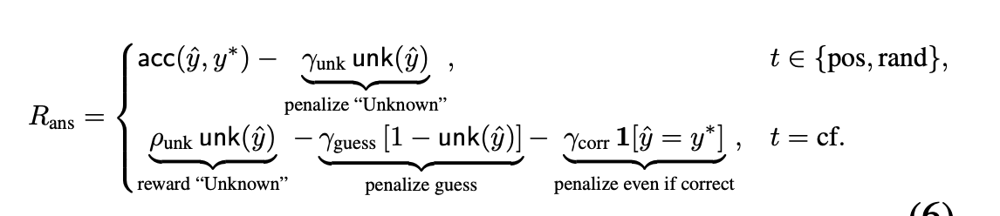
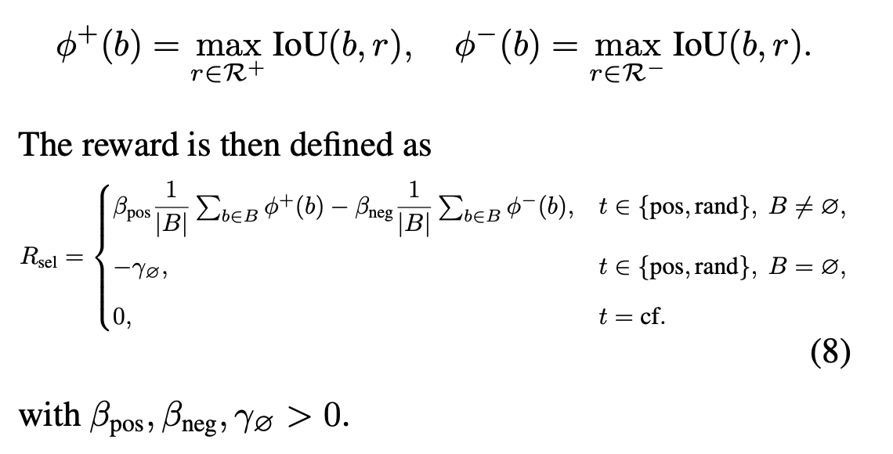

# DeFacto: Counterfactual Thinking with Images for Enforcing Evidence-Grounded and Faithful Reasoning

## One-line thesis

> DeFacto 通过反事实证据遮挡、区域定位和 GRPO 强化学习，使视觉语言模型学会先寻找支持答案的关键区域，并在证据缺失时拒答，从而提升答案准确率与证据-答案一致性。

## Problem / Gap

> 现有的方法在确保证据-答案一致性时存在问题

## Related Work

### 多模态大语言模型

MLLM 通过视觉编码器与语言模型的结合，支持视觉问答、图像描述、OCR 和多模态推理。Qwen2.5-VL 是本文采用的基础模型，具有较强的通用视觉理解、OCR 和文档理解能力。本文关注的问题不是单纯提升视觉问答准确率，而是确保模型给出的答案确实由图像中的相关证据支持。

### 视觉-语言反事实推理

相关工作大致分为两类：一类通过构造反事实数据减少语言偏置和幻觉，例如 CoCT、C-VQA、CRIPP-VQA、Counterfactual Vision and Language Learning、Counterfactual Contrastive Learning 和 CounterCurate；另一类在推理阶段进行反事实干预，例如 Counterfactual-based Saliency Maps、DiG-IN 和 Counterfactual VQA。MM-Verify 则通过验证模型检查多模态推理轨迹。DeFacto 的区别在于：通过遮挡问题所需的视觉证据，要求模型在证据缺失时输出 Unknown，并将这种反事实监督与区域定位和最终答案联合起来。

### Thinking with Images 与视觉 grounding

“Thinking with images”方法将裁剪、缩放、OCR、检测框等显式视觉操作加入推理过程。Visual CoT、GRIT、REFOCUS、COGCOM 和 VisionReasoner 重点研究结构化视觉推理或视觉操作链；DeepEyes、ViCrop、Chain-of-Focus、Ground-R1、V*、Visual-RFT、PAPO 和 TreeVGR 则分别从工具调用、小目标感知、自适应搜索、grounding 奖励、强化学习或可追踪证据等角度提升视觉定位能力。DeFacto 进一步强调证据-答案一致性：不仅要求模型找到区域，还要求在正确证据被移除时放弃作答，从而减少 spurious correctness。

## Method

> 构建了一个语言先验的pipeline辅助定位问题相关区域和依托构建出对的数据集DeFacto-100K。以及在数据集基础上设计的3种互补损失函数，以提升答案准确率，结构化推理能力和证据一致性。此外作者还引入了一个人工标注的benchmark以系统评估评估答案准确性之外，答案grounded一致性。通过pipeline训练的模型同时提升了答案的准确率和证据的一致性。

### 数据集构造pipeline
>  将训练拆解成3种不同范式： 1.正样本 2.事实遮挡 3.随机mask

1. 正样本的case中，训练模型预测正确的答案区域
2. 在反事实的case中，正确区域被mask并且模型需要输出一个指定的token（例如“不知道”）
3. 在随机mask中，用于防止shortcut现象，不允许触发unkown信息
### 反事实 GRPO 训练
#### 序列化建模
将推理过程建模为一个马尔可夫决策过程，模型与问题&图像在一个序列化状态下交互。在每一步中，状态$s_t$编码了多模态上下文，包括输入问题，图像表征和历史的预测区域。策略模型$\pi_\theta$输出了一个新的边界框定位问题相关的证据或者一个STOP token终止这个过程。
#### 奖励设计
设计3个奖励组件
1. 答案正确奖励

2. 格式一致性奖励

3. 区域选择一致性奖励

## Experiments

### 实验设置
#### baselines

> 作者将 **DEFACTO** 与一系列近期明确将视觉推理融入多模态语言模型的方法进行比较。具体包括 **QWEN2.5-VL**（Bai 等，2025），一种广泛用于视觉理解的强大预训练基础模型；**VICROP**（Zhang 等，2025a），通过推理时裁剪提升模型对小物体的感知能力；**GRIT**（Fan 等，2025），通过强化学习整合有视觉依据的推理轨迹；**DEEPEYES**（Zheng 等，2025），鼓励模型在推理过程中调用视觉工具；以及 **VISUAL-SR1**（Li 等，2025），通过自我修正增强逐步式视觉推理能力。这些方法既包括当前具有代表性的基础模型，也包括近期用于视觉推理的“通过图像进行思考”（thinking with images）算法。

#### benchmarks

> 训练和评估覆盖通用 VQA、文档理解、场景文字和综合多模态理解任务。通用 VQA 包括 VQAv2、OKVQA、GQA、ScienceQA、VizWiz 和 VSR；文档/结构化数据集包括 DocVQA、ChartQA、InfoVQA、DeepForm、Kleister KLC 和 WikiTableQuestions；场景文字和图表理解包括 STVQA、TextVQA 和 AI2D；此外还在 OCRBench、MMStar、MMMU、MMBench 1.1 和 POPE 上进行更广泛的比较。

> 为专门评估证据 grounding，作者构建了人工标注的 **DeFacto-1.5K**，从 15 个基准中各抽取 100 个样本。标注者为每个问题标注一个或多个支持正确答案的关键证据框。Faithfulness 评估使用 IoU、AP50、AP75、mAP 和 answer accuracy；其中 mAP 被作为主要的证据-答案一致性指标。

#### training setup

> 以 Qwen2.5-VL-7B 为 backbone，使用 AdamW 和 GRPO 进行训练。学习率为 $1\times10^{-6}$，训练 1 个 epoch，global batch size 为 8，micro-batch size 为 1，gradient accumulation 为 2，使用 BF16 和最大范数为 1.0 的梯度裁剪；实验在 8 张 NVIDIA H100 80GB GPU 上完成。GRPO 的 group size 设置为 4。

### 主要结果

> **通用 VQA。** DeFacto 在 VQAv2、OKVQA、GQA、VizWiz 和 VSR 上相较 Qwen2.5-VL-7B 分别提升 5.1、2.8、10.7、7.3 和 7.4 个百分点，在 ScienceQA 上小幅提升 0.6 个百分点。对应结果为：VQAv2 72.1、OKVQA 61.7、GQA 63.9、ScienceQA 83.6、VizWiz 61.4、VSR 71.0。

> **文档和场景文字。** DeFacto 在 9 个文档/文字基准上均超过 Qwen2.5-VL-7B：DocVQA 94.0（+2.0）、ChartQA 82.1（+7.7）、InfoVQA 79.1（+7.6）、DeepForm 45.6（+17.7）、KLC 38.9（+2.4）、WTQ 63.7（+1.4）、STVQA 71.2（+3.3）、TextVQA 82.9（+3.8）和 AI2D 76.1（+6.6）。

> **更广泛的多模态评估。** 在 OCRBench、MMStar、MMMU、MMBench 1.1 和 POPE 上，DeFacto 分别取得 871、63.2、56.6、81.2 和 88.6，说明区域证据训练不仅改善 VQA，也能迁移到 OCR、综合推理和幻觉评估任务。

> **Faithful reasoning evaluation。** 在 DeFacto-1.5K 上，DeFacto 达到 mAP 35.5、AP50 49.8、AP75 35.0、IoU 49.2 和 answer accuracy 60.8，均优于 Qwen2.5-VL、SFT 变体和 GRPO baseline。这里主要评估预测 bbox 是否覆盖人工标注的证据区域，以及最终答案是否正确；并不直接判断 `<think>` 文本中的每一步推理是否正确。

### Ablation 与分析

> **训练组件消融。** 仅使用 SFT（无反事实训练）时，VQAv2/OKVQA/SciQA/VSR/DocVQA/TextVQA 为 61.2/42.0/82.7/54.5/51.9/56.0。加入反事实 alignment 和 random masking 后变为 66.5/55.7/84.7/53.7/84.3/73.0，说明反事实 Unknown 监督对答案准确率和文档/文字理解尤其有效。加入 GRPO 但不使用 counterfactual reward 后为 70.4/56.9/85.9/58.4/85.4/72.8；完整 DeFacto 进一步达到 72.1/61.7/83.6/71.0/94.0/82.9。相较无 counterfactual reward 的 GRPO，完整方法在 VQAv2、OKVQA、VSR、DocVQA 和 TextVQA 上分别提升 1.7、4.8、12.6、8.6 和 10.1 个百分点。

> **区域级失败模式。** 相较 GRIT，DeFacto 将 Mislocalized & Wrong 从 43.5% 降至 21.5%，Spurious Correct 从 11.6% 降至 5.6%，Faithful but Wrong 从 30.1% 降至 1.3%。这表明它不仅减少了错误定位，也减少了“证据错误但答案碰巧正确”的情况。

> **反事实鲁棒性。** 遮挡人工标注的证据区域后，DeFacto 输出 Unknown 的准确率为 64.1%；完全替换图像后，Unknown abstention accuracy 为 61.4%。这说明模型在缺少必要视觉证据时更倾向于拒答，而不是依赖问题和语言先验猜测答案。

> **Faithfulness 指标消融。** 在 DeFacto-1.5K 上，Qwen2.5-VL base 的 mAP/AP50/AP75/Accuracy 为 0.7/1.4/0.7/52.5；完整 DeFacto 为 35.5/49.8/35.0/60.8。单独的 SFT 几乎不能学会可靠的区域 grounding，而加入 CF alignment 后为 2.9/4.4/1.7/57.0，再加入 GRPO 和区域相关奖励后显著提升。

## Key Findings

>通过对比训练可以有效提升模型的bbox准确率和答案一致性，而不是随机定位之后瞎猜（可能？没有对推理过程进行校验）

## Limitations

> 训练开销相较于opsd极大，而且还需要先做SFT对齐格式

## Connections

>之前的工作包括“thinking with image”将直接的视觉步骤加入多模态推理中以解释推理的可解释性和视觉grounding。也有工作通过SFT让模型在cot中生成区域

## Relevance to This Project

> VCSD提升视觉grounding能力或者细粒度定位能力，Defacto提升反思能力
