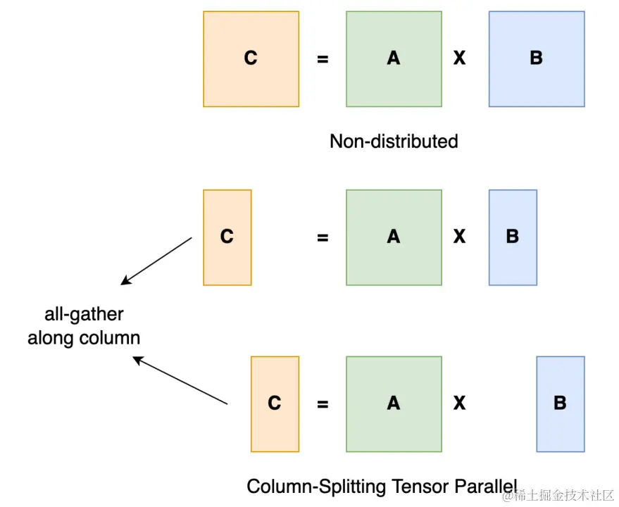
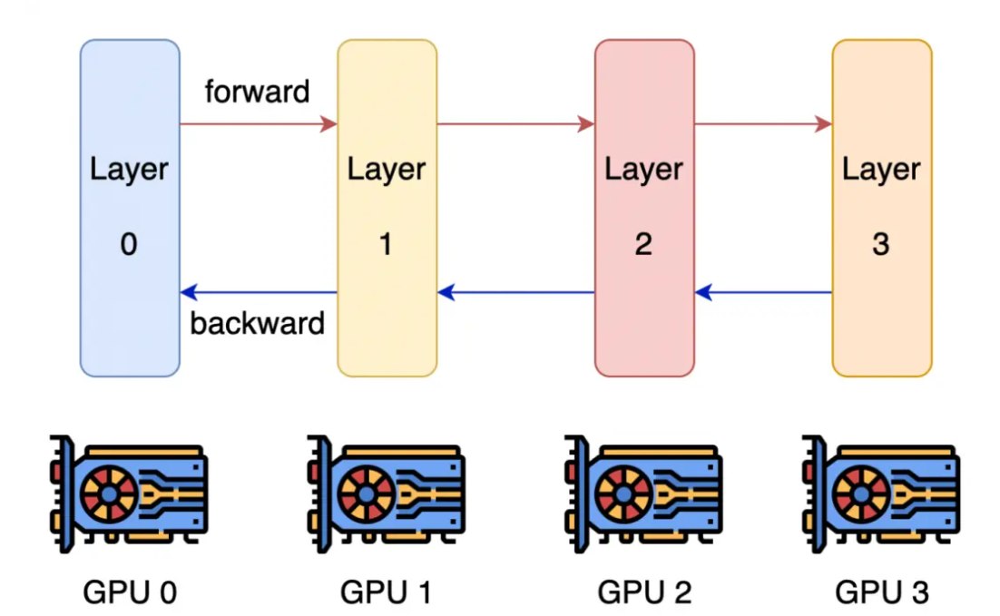

# DeepSpeed

## One-line thesis

> 我们于今年 2 月份发布了 DeepSpeed。这是一个开源深度学习训练优化库，其中包含的一个新的显存优化技术—— ZeRO（零冗余优化器），通过扩大规模，提升速度，控制成本，提升可用性，极大地推进了大模型训练能力

---

## Contribution
1. 用 3D 并行化实现万亿参数模型训练
2. ZeRO-Offload 使 GPU 单卡能够训练 10 倍大的模型
3. 通过 DeepSpeed Sparse Attention 用6倍速度执行10倍长的序列
4. 1 比特 Adam 减少 5 倍通信量

## 3D 并行：扩展至万亿参数模型

### 数据并行

> 数据并行是最常见的并行形式，因为它很简单。在数据并行训练中，数据集被分割成几个碎片，每个碎片被分配到一个设备上。这相当于沿批次（Batch）维度对训练过程进行并行化。每个设备将持有一个完整的模型副本，并在分配的数据集碎片上进行训练。在反向传播之后，模型的梯度将会聚合（All Reduce），以便在不同设备上的模型参数能够保持同步。典型的数据并行实现：PyTorch DDP

**数据并行**是深度学习中的一种普遍使用的技术。在该技术中，每批输入的训练数据都在数据并行的 worker 之间平分。反向传播后需要通信并规约梯度，以保证优化器在各个 worker 上进行相同的更新。数据并行性具有几个明显的优势，包括计算效率高和实现起来工作量小。但是，数据并行的 batch 大小随 worker 数量提高，而<mark>我们往往无法在不影响收敛性的情况下一直增加 batch 大小</mark>

- <mark>显存效率：</mark>数据并行会在所有 worker 之间进行模型和优化器的复制，因此显存效率不高。DeepSpeed 开发了 ZeRO ，它是一系列用于提高数据并行的显存效率的优化器。 这项工作依赖于 ZeRO 的 1 阶段，该阶段在 worker 之间划分优化器状态量以减少冗余。

- <mark>计算效率：</mark>随着我们提高并行度，每个 worker 执行的计算量是恒定的。数据并行可以在小规模上实现近乎线性扩展。但是，在 worker 之间规约梯度的通信开销跟模型大小成正相关，所以当模型很大或通信带宽很低时，计算效率会受限。。梯度累积是一种用来均摊通信成本的一种常用策略。它会进一步增加batch大小，在本地使用 micro-batch 多次进行正向和反向传播积累梯度后，再进行梯度规约和优化器更新。

### 模型并行
> 模型并行的最原始定义是将模型分割并分布在一个设备阵列上，分为张量并行和流水线并行。张量并行是在一个操作进行并行计算例如矩阵乘法，流水线并行则是在各层之间进行并行计算。

<table>
<tr>
<td width="45%"></td>
<td width="55%" style="vertical-align: middle; padding-left: 24px;">

以一般的矩阵乘法为例，假设我们有 <code>C = AB</code>。我们可以将 <code>B</code> 沿着列分割成 <code>[B₀ B₁ B₂ ... Bₙ]</code>，每个设备持有一列。然后将 <code>A</code> 与每个设备上 <code>B</code> 中的每一列相乘，得到 <code>[AB₀ AB₁ AB₂ ... ABₙ]</code>。此时每个设备仍然持有一部分的结果（如 rank=0 持有 <code>AB₀</code>）。为了确保结果的正确性，需要收集全部的结果并沿列维串联张量。通过这种方式，我们能够将张量分布在设备上，同时确保计算流程保持正确。

</td>
</tr>
</table>

模型并行是包含范围很广的一类技术。它会在多个 worker 之间划分模型的各个层。就其本质而言，模型并行性的计算和通信因模型结构而异，因此在实现上有很大的工作量。DeepSpeed 借用了英伟达的 Megatron-LM 来为基于 Transformer 的语言模型提供大规模模型并行功能。模型并行会根据 worker 数量成比例地减少显存使用量，也是这三种并行度中显存效率最高的。但是其代价是计算效率最低。

- <mark>显存效率：</mark>模型并行会根据 worker 数量成比例地减少显存使用量。至关重要的是，这是减少单个网络层的激活显存的唯一方法。DeepSpeed 通过在模型并行 worker 之间划分激活显存来进一步提高显存效率。

- <mark>计算效率：</mark>由于每次前向和反向传播中都需要额外通信激活值，模型并行的计算效率很低。模型并行需要高通信带宽，并且不能很好地扩展到通信带宽受限的节点。此外，每个模型并行worker 都会减少每个通信阶段之间执行的计算量，从而影响计算效率。模型并行性通常与数据并行性结合使用，以在内存和计算效率之间进行权衡。

### 流水线并行

<table>
<tr>
<td width="45%"></td>
<td width="55%" style="vertical-align: middle; padding-left: 24px;">

流水线并行的核心思想是，模型按层分割成若干块，每块都交给一个设备。在前向传播过程中，每个设备将中间的激活传递给下一个阶段。在后向传播过程中，每个设备将输入张量的梯度传回给前一个流水线阶段。这允许设备同时进行计算，从而增加训练的吞吐量。流水线并行将模型的各层划分为可以并行处理的阶段。当一个阶段完成一个 micro-batch 的正向传递时，激活内存将被通信至流水线的下一个阶段。类似地，当下一阶段完成反向传播时，将通过管道反向通信梯度。必须同时计算多个 micro-batch 以确保流水线的各个阶段能并行计算。目前已经开发出了几种用于权衡内存和计算效率以及收敛行为的方法，例如 PipeDream。DeepSpeed 采用的方法是通过梯度累积来实现并行，并保持与传统数据并行和模型并行训练在相同的总 batch 大小下收敛情况相同。

</td>
</tr>
</table>

- <mark>显存效率：</mark>流水线并行减少的显存与流水线的阶段数成正比，使模型的大小可以随 worker 的数量线性扩展。但是，流水线并行不会减少每一层的激活函数的显存占用量。此外，每个 worker 必须存储同时运行的各个 micro-batch 的激活值。这导致流水线第一阶段的激活内存与单个 mirco batch 的总激活内存大致相同。一个万亿参数模型将需要为一个 micro batch 提供大约 19 GB 的显存的激活内存，这几乎占到新推出的英伟达 A100 GPU 总显存的一半。

- <mark>计算效率：</mark>流水线并行具有最低的通信量，因为它的通信量只和在各阶段边界的各层的激活值大小成正比。但是，它不能无限扩展。像模型并行一样，增加流水线大小会减少每个流水线阶段的计算量，这会降低计算与通信的比率。如果要实现好的计算效率，流水线并行还要求其每个阶段的计算负载完美的均衡。

此外，流水线并行性会在每个 batch 的开始和结束时因为需要重新填充或排空流水线而产生 bubble overhead。使用流水线阶段数的 4 倍或 8 倍的梯度累积步骤（以及 batch 大小）进行训练，相较于只有一个流水线阶段分别达到了 81％ 和 90％ 的扩展性。

## 参考文献

[1] [大模型分布式训练并行技术](https://juejin.cn/post/7195845066887053368)，掘金，2023

[2] [[译] DeepSpeed：所有人都能用的超大规模模型训练工具](https://juejin.cn/post/6916500899577724942)，掘金（原作者：Microsoft DeepSpeed Team）