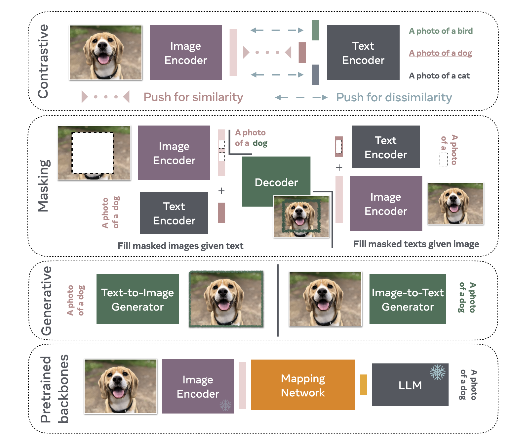

# An Introduction to Vision-Language Modeling（视觉-语言建模导论）

## 摘要（中文翻译）

随着大语言模型（LLM）的近期流行，许多尝试将其扩展到视觉领域。从能够引导我们穿越陌生环境的视觉助手，到仅凭高层次文本描述生成图像的生成模型，视觉-语言模型（VLM）的应用将深刻影响我们与技术的关系。然而，要提高这些模型的可靠性，仍有许多挑战需要解决。语言是离散的，而视觉存在于一个更高维度的空间中，其中的概念并不总能被轻易离散化。为了更好地理解将视觉映射到语言的机制，我们撰写了这篇 VLM 导论，希望能帮助任何想要进入该领域的人。首先，我们介绍 VLM 是什么、它们如何工作以及如何训练它们。然后，我们介绍并讨论评估 VLM 的方法。虽然本文主要关注将图像映射到语言，但我们也讨论了将 VLM 扩展到视频领域。

## One-line thesis

A comprehensive tutorial and entry guide to vision-language models (VLMs), categorizing training paradigms into four types — contrastive, masked, generative, and pretrained-backbone-based — while providing practical training guidance, responsible evaluation practices, and a discussion of extending VLMs to video.

## 引言（中文翻译）

近年来，语言建模领域取得了令人瞩目的进展。Llama、ChatGPT 等大语言模型（LLM）已经能够解决种类繁多的任务，其使用也变得越来越普及。这些原本主要局限于文本输入的模型，现在被扩展到接受视觉输入。将视觉与语言连接起来，将解锁若干对当前基于 AI 的技术革命至关重要的应用。尽管已有若干工作将 LLM 扩展到视觉领域，但语言与视觉的连接问题并未完全解决。例如，大多数模型难以理解空间关系或计数，除非借助复杂的数据标注工程开销。许多 VLM 也缺乏对属性和顺序的理解，常常忽略输入提示的部分内容，导致需要大量的提示工程才能产生期望结果。部分模型还会产生幻觉，生成既不需要也不相关的内容。因此，开发可靠的模型仍然是一个非常活跃的研究领域。

在本文中，我们介绍视觉-语言模型（VLM）。我们解释 VLM 是什么、如何训练它们，以及如何根据不同研究目标有效评估 VLM。本文不应被视为综述或完整的 VLM 指南——我们并非旨在引用该领域的每一篇工作，也不试图囊括所有最佳实践。相反，我们的目标是为 VLM 研究提供一个清晰易懂的入门介绍，并重点介绍该领域的有效实践。本导论对于想要进入这一领域的学生或其他领域的研究者尤其有用。

我们首先介绍不同的 VLM 训练范式。我们讨论对比学习策略和生成组件。最后，我们介绍使用预训练骨干网络（如 LLM）的 VLM。将 VLM 归类为不同家族并非易事，因为大多数模型都有重叠的组件。但我们希望我们的分类法能够帮助新研究者导航这一领域，并揭示 VLM 背后的内部机制。

接下来，我们介绍训练 VLM 的典型配方。例如，我们涵盖：不同研究目标下哪些数据集是合适的？哪种数据整理策略？我们需要训练文本编码器，还是可以利用预训练的 LLM？对比损失足以实现视觉理解，还是生成组件是关键？我们还介绍用于提升模型性能、接地能力以及更好的对齐能力的常用技术。

虽然提供训练模型的配方是更好地理解 VLM 需求的关键步骤，但对这些模型进行稳健可靠的评估同样重要。近期引入了许多用于评估 VLM 的基准测试，然而其中一些基准测试存在研究者应该知晓的基本局限性。通过讨论 VLM 基准测试的优势和劣势，我们希望揭示改进我们对 VLM 理解所面临的挑战。我们首先讨论评估 VLM 视觉-语言能力的基准测试，然后介绍如何衡量偏差。

下一代 VLM 将能够通过将视频映射到语言来理解视频。然而，视频存在不同于图像的各种挑战。计算成本当然高得多，但还有关于如何通过文本映射时间维度的其他考虑。通过阐明当前从视频中学习的方法，我们希望指出当前需应对的研究挑战。

通过降低进入 VLM 研究的门槛，我们希望为推动 VLM 的负责任发展奠定基础，同时拓展视觉理解的边界。

## 目录结构（点击跳转）

- **[1. 引言](#sec-引言-中文翻译)** — 背景、VLM 面临的挑战、本文定位
- **[2. VLM 家族分类](#第二章vlm-家族分类)**
  - 2.1 基于 Transformer 的早期 VLM 工作（VisualBERT、ViLBERT）
  - 2.2 基于对比学习的 VLM（CLIP、SigLIP、Llip）+ 能量模型 / InfoNCE 理论
  - 2.3 基于掩码目标的 VLM（FLAVA、MaskVLM）+ 信息论视角
  - 2.4 基于生成的 VLM（CoCa、CM3Leon、Chameleon；用扩散模型做判别任务）
  - 2.5 基于预训练骨干网络的 VLM（Frozen、MiniGPT-4/5/v2、Qwen-VL、BLIP-2）
- **[3. VLM 训练指南](#sec-VLM-训练指南)**
  - 3.1 训练数据（DataComp、启发式过滤、CLIPScore、MetaCLIP；合成数据、数据增强、交织数据、质量评估、人工标注）
  - 3.2 软件与硬件（OpenCLIP、transformers、GPU 预算估算、torch.compile、xformers、FFCV）
  - 3.3 如何选择模型（何时用对比学习 / 掩码 / 生成 / 预训练骨干网）
  - 3.4 提升接地能力（边界框标注、负样本描述）
  - 3.5 提升对齐能力（指令微调、RLHF、LLaVA 系列、多模态上下文学习）
  - 3.6 提升富含文本图像的理解能力（LLaVAR、Monkey、Lumos）
  - 3.7 参数高效微调 PEFT（LoRA、QLoRA、VeRA、DoRA；CoOp、VPT；Adapter；MAPL、LiMBeR）
- **[4. 负责任的 VLM 评估](#sec-负责任的-VLM-评估)**
  - 4.1 视觉-语言能力基准测试（图像描述、文本到图像一致性、VQA、文本中心 VQA、零样本分类、组合推理、密集描述、合成数据评估）
  - 4.2 偏差与差异基准测试（基于分类、基于嵌入、语言偏差警告、训练数据概念影响）
  - 4.3 幻觉基准测试（CHAIR、POPE、GAVIE、MMHal-Bench）
  - 4.4 记忆化基准测试（déjà vu、k-NN 测试、文本随机化）
  - 4.5 红队测试
- **[5. 将 VLM 扩展到视频](#sec-将-VLM-扩展到视频)**
  - 5.1 基于 BERT 的早期视频工作（VideoBERT、MERLOT）
  - 5.2 早期融合 VLM 实现文本生成（VideoOFA）
  - 5.3 使用预训练 LLM（Video-LLaMA、Video-LLaVA、MiniGPT4-Video）
  - 5.4 评估中的机遇（EgoSchema、ActivityNet-QA、基于物理的合成数据）
  - 5.5 视频数据利用的挑战（稀缺的时序标注、名词偏置、计算成本、冗余问题）
- **[6. 结论](#sec-Key-Results)** — 主要发现与开放问题

## Problem / Gap

VLMs remain challenging for newcomers due to the rapid pace of the field, the diversity of training paradigms, and scattered practical guidance. Existing resources either focus narrowly on specific models or assume significant prior knowledge. There was no accessible, unified entry point covering the full VLM landscape — from foundational paradigms through training recipes, evaluation best practices, bias/fairness considerations, hallucination detection, and video extensions — aimed at students and researchers entering the field.

## 第二章：VLM 家族分类

> 以下为论文第二章 *"The Families of VLMs"*（第5–16页）的完整中文翻译，原样保留所有公式与图片。

---

鉴于深度学习在计算机视觉和自然语言处理领域带来的令人瞩目的进展，已有许多尝试将这两个领域连接起来。在本文中，我们聚焦于基于 Transformer [Vaswani et al., 2017] 的最新技术。我们将这些近期的尝试归为四种不同的训练范式（见图 1）。

**Figure 1: VLM 家族分类。**

对比训练是一种常用策略，它利用正例对和负例对。VLM 被训练为对正例对预测相似的表示，而对负例对预测不同的表示。掩码是另一种可用于训练 VLM 的策略，通过在给定未掩码文本标注的条件下重建缺失的图像块。类似地，通过掩码标注中的词语，可以训练 VLM 在给定未掩码图像的条件下重建这些词语。虽然大多数方法利用中间表示或部分重建，但生成式 VLM 的训练方式使其能够生成整个图像或非常长的标注。鉴于这些模型的本质，它们的训练成本通常是最高的。基于预训练骨干网的 VLM 通常利用开源 LLM（如 Llama）来学习图像编码器（也可以是预训练的）与 LLM 之间的映射。需要强调的是，这些范式并非互斥的；许多方法依赖于对比、掩码和生成标准的混合。

### 2.1 基于 Transformer 的早期 VLM 工作

通过使用 Transformer 架构 [Vaswani et al., 2017]，BERT（Bidirectional Encoder Representations from Transformers）[Devlin et al., 2019] 在当时显著超越了所有语言建模方法。毫不奇怪，研究者将 BERT 扩展以处理视觉数据。其中两个工作是 VisualBERT [Li et al., 2019] 和 ViLBERT [Lu et al., 2019]，它们将文本与图像 Token 相结合。这些模型在两个目标上进行训练：1）经典的掩码建模任务，旨在预测给定输入中缺失的部分；2）句子-图像预测任务，旨在预测一段标注是否真正描述了图像内容。通过利用这两个目标，这些模型在多个视觉-语言任务上取得了强大的性能，这主要归功于 Transformer 模型通过注意力机制学习将词语与视觉线索关联起来的能力。

### 2.2 基于对比学习的 VLM

对比训练通常从基于能量的模型（Energy-Based Models, EBM）视角 [LeCun et al., 2006] 来理解最为合适，其中模型 $E_\theta$（参数为 $\theta$）被训练为对观测变量赋予低能量，对未观测变量赋予高能量。来自目标分布的数据应具有低能量，而任何其他数据点应具有更高能量。为训练这些模型，我们考虑输入数据 $x$ 及其能量函数 $E_\theta(x)$（参数为 $\theta$）。对应的待学习玻尔兹曼分布密度函数可写为：

$$p_\theta(x) = \frac{e^{-E_\theta(x)}}{Z_\theta}$$

其中归一化因子 $Z_\theta = \sum_x e^{-E_\theta(x)}$。为了估计数据所来自的目标分布 $P_D$，我们原则上可以使用传统的最大似然目标：

$$\arg\min_\theta \mathbb{E}_{x\sim P_D(x)}[-\log P_\theta(x)]$$

其梯度为：

$$\frac{\partial \mathbb{E}_{x\sim P_D(x)}[-\log P_\theta(x)]}{\partial \theta} = \mathbb{E}_{x^+\sim P_D(x)}\frac{\partial E_\theta(x^+)}{\partial \theta} - \mathbb{E}_{x^-\sim P_\theta(x)}\frac{\partial E_\theta(x^-)}{\partial \theta}$$

然而，上式需要 $x^-\sim P_\theta(x)$，即来自模型分布的样本，而这可能是不可解的。有几种技术可以近似这样的分布。一种依赖于马尔可夫链蒙特卡洛（MCMC）技术，通过迭代过程找到最小化预测能量的样本。第二种依赖于分数匹配（Score Matching）[Hyvärinen, 2005] 和去噪分数匹配（Denoising Score Matching）[Vincent, 2011] 准则，这些准则通过仅学习概率密度对输入数据的梯度来移除归一化因子。另一类方法——也是大多数近期自监督学习和 VLM 工作的基础——是噪声对比估计（Noise Contrastive Estimation, NCE）[Gutmann and Hyvärinen, 2010]。

NCE 背后的直觉是，与其使用模型分布来采样负例，不如从噪声分布 $u' \sim p_n(u')$ 中采样，这在某些情况下可能足够好地近似模型分布的样本。尽管从理论上证明这种方法的有效性可能很困难，但在近期自监督学习（SSL）文献 [Chen et al., 2020] 中，基于 NCE 方法的成功有充分的实证证据。原始的 NCE 框架可以被描述为一个二分类问题：模型应对来自真实数据分布的样本预测标签 $C=1$，对来自噪声分布的样本预测 $C=0$。通过这样做，模型学会区分真实数据点和噪声数据点。因此损失函数可以定义为带交叉熵的二分类：

$$\mathcal{L}_{\text{NCE}}(\theta) := -\sum_i \log P(C_i=1|x_i;\theta) - \sum_j \log P(C_j=0|x_j;\theta) \tag{1}$$

其中 $x_i$ 从数据分布中采样，$x_j \sim p_n(x), j \neq i$ 从噪声分布中采样。

Wu et al. [2018] 引入了无正例对的 NCE，使用带显式归一化和温度参数 $\tau$ 的非参数 softmax。Oord et al. [2018, CPC] 保留了非参数 softmax 同时使用正例对，并将此方法称为 InfoNCE：

$$\mathcal{L}_{\text{InfoNCE}} = -\sum_{(i,j)\in\mathcal{P}} \log\left(\frac{e^{\text{CoSim}(z_i,z_j)/\tau}}{\sum_{k=1}^{N} e^{\text{CoSim}(z_i,z_k)/\tau}}\right) \tag{2}$$

InfoNCE 损失不是预测二值，而是利用在模型表示空间中计算的距离度量（如余弦相似度）。这需要计算正例对之间以及所有负例对之间的该距离。模型通过 softmax 学习预测表示空间中最接近的最可能例对，同时对所有其他负例对赋予较低概率。对于 SimCLR [Chen et al., 2020] 等 SSL 方法，一个正例对定义为一幅图像及其对应的人工设计的数据增强版本（如对原始图像应用灰度化），而负例对则由一幅图像与同一 mini-batch 中所有其他图像构成。基于 InfoNCE 的方法的主要缺点是对 mini-batch 内容的依赖性，这通常需要较大的 mini-batch 以使正负样本之间的对比训练准则更有效。

#### 2.2.1 CLIP

使用 InfoNCE 损失的常见对比方法是 CLIP（Contrastive Language–Image Pre-training）[Radford et al., 2021]。正例对被定义为一幅图像及其对应的真实标注（ground truth caption），而负例被定义为同一幅图像与 mini-batch 中描述其他图像的所有其他标注。CLIP 的一个创新之处在于训练模型将视觉和语言纳入一个共享的表示空间。CLIP 训练随机初始化的视觉和文本编码器，使用对比损失将图像及其标注的表示映射到相似的嵌入向量。最初的 CLIP 模型在从网络收集的 4 亿标注-图像对上训练，展现了卓越的零样本分类迁移能力。具体而言，ResNet-101 CLIP 达到了与有监督 ResNet [He et al., 2015] 相匹敌的性能（达到 76.2% 的零样本分类准确率），并在多个鲁棒性基准上超越了它。

**SigLIP** [Zhai et al., 2023b] 与 CLIP 类似，不同之处在于它使用基于二分类交叉熵的原始 NCE 损失，而非 CLIP 基于 InfoNCE 的多分类目标。这一改变在较小批量大小下实现了比 CLIP 更好的零样本性能。

**Llip**（Latent Language Image Pretraining）[Lavoie et al., 2024] 考虑了图像可以有多种不同标注方式的事实。它提出通过交叉注意力模块将图像编码条件化于目标标注之上。考虑标注的多样性增加了表示的表达能力，并且通常能提高下游零样本迁移分类和检索性能。

### 2.3 基于掩码目标的 VLM

掩码是深度学习研究中一种常用的技术。它可以被视为一种特定形式的去噪自编码器 [Vincent et al., 2008]，其中噪声具有空间结构。它也与图像修复策略有关，Pathak et al. [2016] 特别使用该策略来学习强大的视觉表示。最近，BERT [Devlin et al., 2019] 在训练期间使用掩码语言建模（Masked Language Modeling, MLM）来预测句子中缺失的 Token。掩码特别适合 Transformer 架构 [Vaswani et al., 2017]，因为输入信号的 Token 化使得随机丢弃特定输入 Token 变得更容易。在视觉方面，也有若干工作通过使用掩码图像建模（Masked Image Modeling, MIM）来学习表示，例如 MAE [He et al., 2022] 或 I-JEPA [Assran et al., 2023]。自然地，已有工作将这两种技术结合起来训练 VLM。第一个是 FLAVA [Singh et al., 2022]，它利用包括掩码在内的多种训练策略来学习文本和图像表示。第二个是 MaskVLM [Kwon et al., 2023]，它是一个独立的模型。最后，我们在信息论与掩码策略之间建立一些联系。

#### 2.3.1 FLAVA

基于掩码方法的第一个示例是 FLAVA（Foundational Language And Vision Alignment）[Singh et al., 2022]。其架构包含三个核心组件，每个都基于 Transformer 框架并为处理特定模态而定制。图像编码器采用 ViT（Vision Transformer）[Dosovitskiy et al., 2021] 将图像处理为图像块（patches）以进行线性嵌入和基于 Transformer 的表示，包括一个分类 Token（[CLS$_I$]）。文本编码器使用 Transformer [Vaswani et al., 2017] 将文本输入 Token 化并嵌入为向量，用于上下文处理并输出隐藏状态向量及一个分类 Token（[CLS$_T$]）。这两个编码器都使用掩码方法进行训练。在此基础上，多模态编码器融合来自图像和文本编码器的隐藏状态，利用学习到的线性投影和 Transformer 框架内的交叉注意力机制来整合视觉和文本信息，并以一个额外的多模态分类 Token（[CLS$_M$]）为标志。该模型采用了全面的训练方案，结合了多模态和单模态掩码建模损失以及对比目标。它在 7000 万公开可用的图像-文本对数据集上进行预训练。通过这种方法，FLAVA 展示了卓越的多功能性和有效性，在涵盖视觉、语言和多模态基准的 35 个多样化任务中取得了最先进的性能，从而说明了该模型理解和整合不同领域信息的能力。

#### 2.3.2 MaskVLM

FLAVA 的一个局限性是使用了预训练的视觉编码器，如 dVAE [Zhang et al., 2019]。为了构建一个较少依赖第三方模型的 VLM，Kwon et al. [2023] 引入了 MaskVLM，它直接在像素空间和文本 Token 空间中应用掩码。使其跨文本和图像都能工作的关键之一是使用来自一个模态流向另一个模态的信息流；文本重建任务接收来自图像编码器的信息，反之亦然。

#### 2.3.3 VLM 目标的信息论视角

Federici et al. [2020] 首先表明 VLM 可以被理解为解决一个率-失真（rate-distortion）问题，即减少冗余信息并最大化预测信息。Dubois et al. [2021] 更具体地表明，我们可以将数据 $X$ 上的任何变换 $f(X)$ 理解为隐式地诱导一个等价关系，将空间 $f(X)$ 划分为不相交的等价类。我们的目标是将条件密度约束为在一个区域内恒定，即 $f(x) \sim f(x') \Rightarrow p(z|f(x)) = p(z|f(x'))$，其中 $Z$ 是 $X$ 的学习表示。这一观点将掩码和其他形式的增强统一起来，以及两种数据模态之间的选择函数；所有这些都可以被表示为数据的某种变换。

我们可以将相关的率-失真问题表述为 [Shwartz Ziv and LeCun, 2024]：

$$\arg\min_{p(z|x)} I(f(X); Z) + \beta \cdot H(X|Z) \tag{3}$$

为了恢复掩码 VLM 目标，我们对公式 (3) 进行界定：

$$\mathcal{L} = -\sum_{x\in\mathcal{D}} \mathbb{E}_{p(f)p(Z|f(x))} [\log q(z) + \beta \cdot \log q(x|z)] \tag{4}$$

其中 $\log q(z)$ 是 entropy bottleneck，界定速率 $I(f(X); Z)$，移除冗余信息。注意在掩码 VLM 中，entropy bottleneck 通常由依赖于掩码移除信息量的常数界定。对于多模态 VLM，$Z$ 中的信息量被减少到来自任一来源的最小信息量。项 $\log q(x|z)$ 界定失真 $H(Z|X)$ 并确保信息的保留，从而最大化预测信息。在实践中，该项通过自编码来实现。相比之下，对比损失可以被视为无数据重建的压缩。这里的失真（见公式 (2)）对两个表示的等价性进行评分。InfoNCE 通过分类哪个 $Z$ 与等价样本 $X$ 相关联来保留必要的信息。

根据信息论视角的结果，我们将对比损失和自编码损失理解为失真的实现，而速率主要由所使用的数据变换决定。

### 2.4 基于生成的 VLM

与之前的训练范式主要在潜在表示上操作、构建图像或文本抽象然后在彼此之间进行映射不同，生成范式考虑文本和/或图像的生成。一些方法如 CoCa [Yu et al., 2022b] 学习完整的文本编码器和解码器，从而实现图像标注生成。另一些方法如 Chameleon [Team, 2024] 和 CM3leon [Yu et al., 2023] 是多模态生成模型，显式训练以生成文本和图像。最后，有些模型仅训练为基于文本生成图像，如 Stable Diffusion [Rombach et al., 2022]、Imagen [Saharia et al., 2022] 和 Parti [Yu et al., 2022c]。然而，即使它们仅被训练为生成图像，它们也可以被用来解决多种视觉-语言理解任务。

#### 2.4.1 学习文本生成器的示例：CoCa

除了在 CLIP 中效果良好的对比损失之外，CoCa（Contrastive Captioner）[Yu et al., 2022b] 还采用了生成损失，即对应于由多模态文本解码器生成的标注的损失，该解码器接收 (1) 图像编码器输出和 (2) 单模态文本解码器产生的表示作为输入。新的损失使得无需使用多模态融合模块进行进一步适配，即可执行新的多模态理解任务（如 VQA）。CoCa 通过简单地将标注图像标签视为文本，从零开始预训练。预训练依赖两个数据集：包含约 18 亿张带替代文本（alt-text）图像的 ALIGN，以及 JFT-3B（一个包含超过 29.5k 个类别的内部数据集，但将标签视为替代文本）。

#### 2.4.2 多模态生成模型示例：Chameleon 和 CM3Leon

Yu et al. [2023] 引入了 CM3Leon，一个用于文本到图像和图像到文本生成的基础模型。CM3Leon 借用了 Gafni et al. [2022] 的图像分词器，将 256×256 的图像编码为来自 8192 词汇表的 1024 个 Token。它借用了 Zhang et al. [2022] 的文本分词器，词汇量为 56320。它引入了一个特殊 Token `<break>` 来指示模态之间的转换。这种分词方法使模型能够处理交错的文本和图像。分词后的图像和文本随后被传入一个 decoder-only Transformer 模型 [Brown et al., 2020, Zhang et al., 2022]，该模型参数化了 CM3Leon 模型。

CM3Leon 模型经历两阶段训练过程。第一阶段是检索增强预训练。该阶段使用基于 CLIP 的编码器 [Radford et al., 2021] 作为稠密检索器（dense retriever），获取相关且多样化的多模态文档，并将这些文档前置到输入序列中。然后模型在输入序列上使用下一个 Token 预测进行训练。检索增强有效地增加了预训练期间可用的 Token 数量，从而提高了数据效率。第二阶段涉及监督微调（SFT），模型经历多任务指令微调。该阶段使模型能够跨不同模态处理和生成内容，显著提高了其在各种任务上的性能，包括文本到图像生成和语言引导的图像编辑。这些阶段共同使 CM3Leon 在多模态任务中达到了最先进的性能，展示了自回归模型在处理文本和图像之间复杂交互能力方面的重大进步。

这项工作的一个扩展是 Chameleon，一系列新的混合模态基础模型 [Team, 2024]，可以生成和推理交错的文本和图像内容的混合序列。这种能力使得全面的多模态文档建模成为可能，超越了典型的多模态任务，如图像生成、图像理解和纯文本语言模型。Chameleon 的独特设计在于从一开始就是混合模态的，利用统一的架构，以端到端的方式在所有模态（图像、文本和代码）的混合上从头训练。这种集成方法对图像和文本都采用完全基于 Token 的表示。通过将图像转换为离散 Token（类似于文本中的词语），同一个 Transformer 架构可以应用于图像和文本 Token 的序列，而无需为每种模态分别设置编码器。这种早期融合策略——所有模态从一开始就被映射到共享的表示空间——使得跨不同模态的无缝推理和生成成为可能。然而，这也引入了显著的技术挑战，特别是在优化稳定性和扩展性方面。这些挑战通过架构创新和训练技术的组合得以解决，包括对 Transformer 架构的新颖修改，如查询-键归一化（query-key normalization）和修正的层归一化（layer norm）位置，这对于混合模态环境中的稳定训练至关重要。此外，他们展示了如何将用于纯文本语言模型的监督微调方法适配到混合模态上下文中，实现了大规模下的强对齐。

#### 2.4.3 使用生成式文本到图像模型处理下游视觉-语言任务

最近在语言条件化的图像生成模型上取得了巨大进展 [Bie et al., 2023, Zhang et al., 2023a]，从 Stable Diffusion [Rombach et al., 2022] 和 Imagen [Saharia et al., 2022] 等扩散模型到 Parti [Yu et al., 2022c] 等自回归模型。虽然关注点一直在它们的生成能力上，但它们实际上可以直接用于分类或标注预测等判别任务，无需任何重新训练。

这些生成模型被训练来估计 $p_\theta(x \mid c)$，即给定文本提示 $c$ 下图像 $x$ 的条件似然。然后，给定一幅图像 $x$ 和一组 $n$ 个文本类别 $\{c_i\}_{i=1}^n$，可以通过贝叶斯定理轻松完成分类：

$$p_\theta(c_i \mid x) = \frac{p(c_i) \, p_\theta(x \mid c_i)}{\sum_j p(c_j) \, p_\theta(x \mid c_j)} \tag{5}$$

使用条件生成模型执行判别任务并非新想法——生成式分类，或称"通过合成进行分析"（analysis by synthesis）[Yuille and Kersten, 2006]，一直是朴素贝叶斯 [Rubinstein et al., 1997, Ng and Jordan, 2001] 和线性判别分析 [Fisher, 1936] 等基础方法背后的核心思想。这些生成式分类方法传统上受到生成建模能力薄弱的限制；然而，当今的生成模型已经如此强大，以至于生成式分类器再次变得有竞争力。

**使用自回归模型进行似然估计。** 大多数其他模态（如语言或语音）的最先进自回归模型作用于离散 Token 而非原始输入。这对于语言和语音等本质上是离散的模态相对简单，但对于图像等连续模态则较为困难。为了有效利用 LLM 等自回归建模技术，实践者通常训练一个图像分词器，将图像映射为离散 Token 序列 $(t_1, \cdots, t_K)$。在将图像转换为离散 Token 序列（即对图像进行分词）之后，估计图像似然就变得直接了当：

$$\log p_\theta(x \mid c_i) = \sum_{j=1}^{K} \log p_\theta(t_j \mid t_{<j}, c_i) \tag{6}$$

其中 $p_\theta$ 由自回归 VLM 参数化。鉴于这种分词是自回归 VLM 的关键组成部分，人们可能会问：我们如何训练图像分词器？

许多当前的图像分词器基于 VQ-VAE（Vector Quantised-Variational AutoEncoder）[Van Den Oord et al., 2017] 框架，该框架将自编码器（负责创建良好的压缩连续表示）与矢量量化层（负责将连续表示映射到离散表示）缝合在一起。架构通常是一个 CNN（卷积神经网络）[LeCun and Bengio, 1998] 编码器，后接矢量量化层，再接 CNN 解码器。实际的离散化步骤发生在矢量量化层中，该层将编码器输出映射到学习的嵌入表中最近的嵌入（这里"学习的"意味着嵌入表在整个训练过程中更新）。分词器的损失函数是像素空间中的重建损失（如输入像素和重建像素之间的 L2 距离）与码本承诺损失（codebook commitment losses）的组合，后者鼓励编码器输出和码本嵌入彼此接近。大多数现代图像分词器在 VQ-VAE 框架的基础上进行改进，要么添加不同的损失，要么更改编码器/解码器的架构。值得注意的是，VQ-GAN [Esser et al., 2021] 添加了感知损失和对抗损失（涉及在真实图像和重建图像之间引入判别器），以捕获更细粒度的细节。VIT-VQGAN [Yu et al., 2022a] 使用 ViT 而非 CNN 作为编码器和解码器架构。

**使用扩散模型进行似然估计。** 使用扩散模型获得密度估计更具挑战性，因为它们不直接输出 $p_\theta(x \mid c)$。相反，这些网络 $\epsilon_\theta$ 通常被训练来估计带噪图像 $x_t$ 中的噪声 $\epsilon$。因此，基于扩散的分类技术 [Li et al., 2023a, Clark and Jaini, 2023] 估计条件图像似然的（通常是重加权的）变分下界：

$$\log p_\theta(x \mid c_i) \propto -\mathbb{E}_{t,\epsilon}\left[\|\epsilon - \epsilon_\theta(x_t, c_i)\|^2\right] \tag{7}$$

噪声预测误差越低，条件似然 $p_\theta(x \mid c)$ 就越高。衡量公式 (7) 中的界限依赖于重复采样以获得蒙特卡洛估计。Li et al. [2023a] 和 Clark and Jaini [2023] 开发了减少所需样本数量的技术，动态地将样本分配给最可能的类别，并确保添加的噪声 $\epsilon$ 在所有潜在类别之间匹配。然而，即使使用这些技术，使用条件扩散模型进行分类仍然计算昂贵，其成本随类别数量缩放，并且每张测试图像需要数百或数千次网络评估。因此，虽然扩散模型的分类性能相当好，但在进一步优化之前，推理仍然不切实际。

**生成式分类器的优势。** 尽管这些生成式分类器的推理成本更高，但它们确实具有显著优势。生成式分类器具有更多的"有效鲁棒性"，这意味着在给定分布内准确率的情况下，它们具有更好的分布外性能 [Li et al., 2023a]。在 Winoground [Thrush et al., 2022] 等组合推理任务上，生成式分类器远远优于 CLIP 等判别方法 [Li et al., 2023a, Clark and Jaini, 2023]。无论是自回归（Parti）还是基于扩散（Imagen）的生成式分类器，已被证明具有更多的形状偏置（shape bias），并且与人类判断更好地对齐 [Jaini et al., 2024]。最后，生成式分类器可以在测试时仅使用未标注的测试样本与判别模型联合适配 [Prabhudesai et al., 2023]。这已被证明可以提升分类、分割和深度预测任务的性能，特别是在在线分布偏移场景中。

### 2.5 基于预训练骨干网的 VLM

VLM 的一个缺点是从零开始训练的成本很高。它们通常需要数百到数千个 GPU，同时必须使用数亿的图像和文本对。因此，有很多研究工作不是从头训练模型，而是尝试利用现有的大语言模型和/或现有的视觉提取器。大多数这些工作的动机是许多大语言模型是开源的，因此可以轻松使用。通过利用这些模型，可以仅学习文本模态和图像模态之间的映射。学习这样的映射使 LLM 能够在需要少量计算资源的情况下回答视觉问题。在本节中，我们仅介绍这些模型中的两个：第一个是 Frozen [Tsimpoukelli et al., 2021]，这是第一个利用预训练 LLM 的模型；然后我们介绍 MiniGPT 模型家族 [Zhu et al., 2023a]。

#### 2.5.1 Frozen

Frozen [Tsimpoukelli et al., 2021] 是利用预训练 LLM 的模型的第一个例子。该工作提出通过一个轻量级映射网络将视觉编码器连接到冻结的语言模型上，该映射网络将视觉特征投影到文本 Token 嵌入。视觉编码器（NF-ResNet-50 [Brock et al., 2021]）和线性映射从零开始训练，而语言模型（一个在 C4 [Raffel et al., 2020] 上训练的 70 亿参数 Transformer）保持冻结（这对于维护预训练模型已经学到的特征至关重要）。模型在 Conceptual Captions [Sharma et al., 2018b] 上使用简单的文本生成目标进行监督。在推理时，语言模型可以条件化于交错的文本和图像嵌入。作者展示了该模型能够快速适应新任务、快速访问通用知识，以及快速绑定视觉和语言元素。虽然只取得了中等的性能，但 Frozen 是朝着当前能够进行开放式多模态零样本/少样本学习的多模态 LLM 迈出的重要第一步。

#### 2.5.2 MiniGPT 示例

从 Flamingo [Alayrac et al., 2022] 等模型开始，近期的一个趋势是训练多模态语言模型，其中输入包含文本和图像，输出包含文本（以及可选的图像）。MiniGPT-4 [Zhu et al., 2023a] 接受文本输入和图像输入，并产生文本输出。在 MiniGPT-4 中，使用一个简单的线性投影层将图像表示（使用 BLIP-2 [Li et al., 2023e] 中的相同视觉编码器，该编码器基于 Q-Former 和 ViT 骨干网）与 Vicuna 语言模型 [Chiang et al., 2023] 的输入空间对齐。鉴于视觉编码器和 Vicuna 语言模型已经是预训练的并作为现成模块使用，MiniGPT-4 只需要训练线性投影层，该训练分两轮进行。第一轮涉及 20k 训练步（批量大小为 256），对应来自 Conceptual Captions [Sharma et al., 2018b]、SBU [Ordonez et al., 2011] 和 LAION [Schuhmann et al., 2021] 的约 500 万图像-文本对。作者仅使用了四块 A100 GPU，耗时约十小时，因为只有线性投影层参数需要训练。第二轮训练利用了高度整理的数据，采用指令微调格式，仅需要 400 训练步（批量大小为 12）。

MiniGPT-5 [Zheng et al., 2023] 扩展了 MiniGPT-4，使输出可以包含文本与图像交错。为了也生成图像，MiniGPT-5 使用了生成 Token——特殊的视觉 Token，可以通过 Transformer 层映射到特征向量，然后输入到冻结的 Stable Diffusion 2.1 模型 [Rombach et al., 2021] 中。作者在下游任务（如多模态对话生成和故事生成）上使用了监督训练。

LLM 已成为许多语言相关应用（如通用聊天机器人）的通用接口。受此启发，MiniGPT-v2 [Chen et al., 2023b] 提出通过统一接口执行各种视觉-语言任务，如图像标注、视觉问答和物体接地（object grounding）。为了有效实现这一目标，MiniGPT-v2 在训练时引入了不同任务的唯一标识符，使模型能够轻松区分每个任务指令并高效学习。在视觉问答和视觉接地基准上的实验结果表明，MiniGPT-v2 展现了强大的视觉-语言理解能力。

#### 2.5.3 其他使用预训练骨干网的流行模型

**Qwen。** 与 MiniGPT-4 类似，Qwen-VL 和 Qwen-VL-Chat [Bai et al., 2023b] 模型依赖一个 LLM、一个视觉编码器，以及一个将视觉表示对齐到 LLM 输入空间的机制。在 Qwen 中，LLM 初始化为 Qwen-7B [Bai et al., 2023a]，视觉编码器基于 ViT-bigG，使用一个单层交叉注意力模块将视觉表示压缩为固定长度（256）的序列，该序列随后被输入到 LLM 中。

**BLIP-2。** Li et al. [2023e] 引入了 BLIP-2，这是一个以图像为输入并生成文本输出的视觉-语言模型。它利用预训练的冻结模型来大幅缩短训练时间：视觉编码器（如 CLIP）生成图像嵌入，这些嵌入被映射到 LLM（如 OPT）的输入空间中。一个相对较小（约 1-2 亿参数）的组件——称为 Q-Former——为此映射进行训练。Q-Former 是一个 Transformer，接受固定数量的随机初始化"查询"向量；在前向传播中，查询向量通过 Q-Former 中的交叉注意力与图像嵌入交互，随后通过一个线性层将查询投影到 LLM 的输入空间。

文献中还有更多基于预训练 LLM 的模型。每个 LLM 最终都被扩展为 VLM 版本，这意味着针对此类主题的专门综述将非常庞大。在本导论中，我们仅呈现精选的少数几个，因为它们都依赖于学习表示之间映射的相同原理。

## VLM 训练指南

### 3.1 训练数据

数据筛选方法分为三类：
- **启发式过滤**：单模态（文本复杂度、非英语过滤、分辨率/宽高比）+ 多模态（图像分类器筛选、文字检测去重）
- **基于预训练 VLM 排序**：CLIPScore 计算图文嵌入余弦相似度排名；MetaCLIP 使用元数据字符串匹配构建平衡数据集
- **多样性与平衡**：对长尾分布概念进行子采样，但完全平衡不现实——零样本能力主要取决于下游概念在训练数据中的覆盖度

**合成数据**：BLIP/BLIP2 生成描述性合成标注，LLaVA 作为标注模型，但大规模下合成标注多样性上限受限。**数据增强**：CLIP-rocket 使用不对称增强（弱+强），分离投影器（线性 vs 2层MLP），推理时插值融合。**交织数据**：OBELICS（自然交织）+MM1（合成交织），交织数据提升少样本性能。**质量评估**：QuRating、VILA、LAION-aesthetics 分别评估文本/图像/对齐质量，但缺乏整体的多模态质量评估方法。

### 3.2 软件与硬件

- **软件**：OpenCLIP、HuggingFace transformers 提供大多数 VLM 实现
- **GPU 预算**：CLIP 规模训练需 500+ GPU（数十万美元），但使用高质量数据集+掩码策略，从零训练对比模型约需 64 GPU（~1万美元）。利用预训练骨干网则成本更低
- **加速训练**：torch.compile、xformers（高效注意力）、FFCV（高效数据加载）
- **关键超参数**：图像分辨率 > 视觉编码器容量 > 视觉预训练数据 > 模态连接方式；文本+交织+图文对的正确混合比至关重要

### 3.3 如何选择模型

- **对比学习（CLIP）**：适合数据整理、检索、零样本分类；训练简单，表示空间具有图文双重语义
- **掩码**：无批量依赖（无需负样本），小批量友好；但需额外解码器，效率可能不如纯对比方法
- **生成模型**：可输出可视化结果（无需 k-NN 查找），学习隐式联合分布，但计算成本最高
- **预训练骨干网 + LLM**：适合快速构建 VLM；利用已有 LLM 知识，训练成本最低

### 3.4 提升接地能力（Grounding）

- **边界框标注**：提供空间定位信息
- **负样本描述**：训练模型理解"不是什么"，减少幻觉

### 3.5 提升对齐能力（Alignment）

- **指令微调**：LLaVA 系列（LLaVA、LLaVA-1.5、LLaVA-NeXT）将图文对齐到指令遵循格式
- **RLHF**：人类反馈强化学习对齐
- **多模态上下文学习**：在提示中提供图文示例

### 3.6 提升富含文本图像的理解

- **LLaVAR**：增强文本丰富图像的理解
- **Monkey**：提高输入分辨率以增强 OCR 能力
- **Lumos**：专注于文本中心的视觉理解

### 3.7 参数高效微调（PEFT）

- **LoRA 系列**：LoRA、QLoRA（量化）、VeRA（向量随机化）、DoRA（权重分解）
- **提示方法**：CoOp（连续提示优化）、VPT（视觉提示微调）
- **Adapter 方法**：在预训练层之间插入小型可训练瓶颈模块
- **映射方法**：MAPL、LiMBeR——学习视觉与语言之间的轻量级映射

## 负责任的 VLM 评估

### 4.1 视觉-语言能力基准测试

- **图像描述**：COCO Captions、Flickr30k、NoCaps
- **文本到图像一致性**：TIFA、VPEval、Davidsonian
- **VQA**：VQAv2、GQA、OK-VQA（需外部知识）
- **文本中心 VQA**：TextVQA、ST-VQA、DocVQA——精确字符串匹配指标不足
- **零样本分类**：ImageNet、ObjectNet、ImageNet-R/A/Sketch
- **组合推理**：Winoground、ARO、SugarCrepe——argmax 零向量参数可达 100% 准确率的漏洞
- **密集描述与裁剪匹配**：Dense Captioning、Crop-Caption Matching
- **合成数据评估**：利用程序生成的视觉场景进行受控测试

### 4.2 偏差与差异基准测试

- **基于分类的偏差**：FairFace、DollarStreet——测量跨人口统计的分类差异
- **基于嵌入的偏差**：WEAT、SEAT——测量嵌入空间中的刻板印象关联
- **语言偏差警告**：许多基准测试本身存在语言偏差捷径，影响评估有效性
- **训练数据概念影响**：评估特定训练数据概念对下游性能的影响

### 4.3 幻觉基准测试

- **CHAIR**：测量图像描述中的目标幻觉率
- **POPE**：轮询式目标探测评估
- **GAVIE**：基于 GPT-4 的细粒度幻觉评估
- **MMHal-Bench**：多模态幻觉基准

### 4.4 记忆化基准测试

- **déjà vu 记忆化**：检测训练数据记忆
- **k-NN 测试**：通过最近邻检索评估记忆化
- **文本随机化**：对比原始文本与随机化文本的训练动态

### 4.5 红队测试

对抗性评估，识别模型的安全漏洞和失败模式。

## 将 VLM 扩展到视频

### 5.1 早期基于 BERT 的方法

- **VideoBERT**：将 BERT 扩展到视频，使用矢量量化处理视觉 Token
- **MERLOT**：大规模视频-语言预训练

### 5.2 早期融合文本生成

- **VideoOFA**：早期融合视觉和文本模态进行视频文本生成

### 5.3 使用预训练 LLM

- **Video-LLaMA**：使用视频 Q-Former 桥接冻结视觉编码器和 LLM
- **Video-LLaVA**：将 LLaVA 扩展到视频理解
- **MiniGPT4-Video**：MiniGPT-4 的视频版本

### 5.4 评估中的机遇

- **EgoSchema**：自我中心视频理解
- **ActivityNet-QA**：基于活动视频的问答
- **基于物理的合成数据**：测试物理推理能力——当前视频 VLM 在物理推理任务上表现低于随机水平

### 5.5 视频数据的挑战

- 时序标注稀缺
- 名词偏置（模型依赖名词捷径）
- 计算成本（远高于图像）
- 冗余问题（相邻帧高度相似）

## Key Results

- 提供了统一分类法，将主流 VLM 方法归入四种明确定义的范式
- 识别出关键评估陷阱：语言偏差捷径降低基准测试有效性；部分组合推理基准上 argmax 零向量参数可达 100% 准确率
- 当前视频 VLM 在物理推理任务上表现低于随机水平
- 76 页涵盖约 200 篇参考文献，是 VLM 研究者首选的入门资源
- 重要发现：文本导向 VQA 的精确字符串匹配指标不足——会惩罚语义正确但措辞不同的答案

## Assumptions

- 读者具备深度学习和 Transformer 的基本知识
- 四种范式分类法是有用的方向指南，但承认范式边界在实践中是模糊的
- 训练建议基于已发表结果和社区最佳实践，最优方案可能快速演变
- 评估基准分析反映 2024 年初的基准状态

## Limitations / Failure Modes

- 非全面综述——刻意定位为入门/教程，许多专门的子领域仅简要涉及
- 四类分类法是简化；实际模型越来越多地混合多种范式
- 领域发展迅速，某些具体模型推荐可能很快过时（作者已认识到并侧重于通用原则）
- 训练指南推荐主要基于经验；许多 VLM 现象的理论理解仍不完整

## Reusable Ingredients

- 四种范式分类法作为理解和比较 VLM 方法的心智模型
- 实用训练清单：数据过滤启发式方法、GPU 预算估算公式、超参数指南
- 评估协议：多轴评估覆盖能力、偏差、幻觉、记忆化和红队测试
- 视频 VLM 设计模式：早期融合 vs. 预训练 LLM 骨干网方法
- PEFT 决策树：何时使用 LoRA vs. Adapter vs. Prompt Tuning
- 已知基准测试失败模式警告目录（语言偏差、精确匹配问题、组合推理捷径）

## Open Questions

- 如何设计能抵抗语言偏差捷径和随机重复的基准测试？
- 四种 VLM 范式能否统一为单一通用训练配方？
- 如何在不过高计算成本下扩展视频 VLM 以处理长时序推理？
- 什么评估协议能可靠检测 VLM 开放式生成中的幻觉？
- 如何在减轻记忆化的同时不降低模型实用性？

## Claims

- 四种范式分类法为理解截至 2024 年的 VLM 格局提供了充分的框架
- 负责任的评估需要超越标准能力基准，纳入偏差、幻觉、记忆化和红队测试轴
- 当前视频 VLM 基准测试由于名词偏置和有限的时序推理要求，夸大了进展

## Connections

- **Extends:** `paper:radford2021_clip` (CLIP — Section 2.2 中作为对比式 VLM 的典范广泛讨论；CLIPScore 用于全篇数据整理和评估)
- **Extends:** `paper:dosovitskiy2021_vit` (ViT — 作为 FLAVA、BLIP-2、MiniGPT 等的基础视觉编码器骨干网，VIT-VQGAN 中用于编码器/解码器)
- **Extends:** `paper:li2023_blip2` (BLIP-2 — Section 2.5.3 中以 Q-Former 为代表的预训练骨干网 VLM)

## Relevance to This Project

这是截至 2024 年 VLM 领域的权威入门指南。它将本知识图谱中的基础论文（ViT、CLIP、BLIP-2）整合为统一的叙述，提供了适用于任何 VLM 项目的实用训练指南，并建立了严格的评估标准。其四种范式分类法可作为理解新 VLM 论文之间关系的组织框架。
[[liu2021_swin]]
[[radford2021_clip]]
[[dosovitskiy2021_vit]]
[[li2023_blip2]]