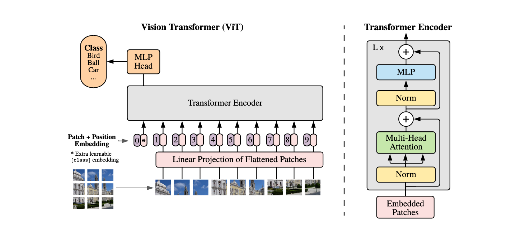

# An Image Is Worth 16x16 Words: Transformers for Image Recognition at Scale

## One-line thesis

A pure Transformer architecture applied directly to sequences of image patches can achieve state-of-the-art image classification when pre-trained at sufficient scale, outperforming convolutional networks with lower pre-training cost.

ViT挑战了CNN的“归纳偏置”。简单来说，归纳偏置就是模型为了让学习问题变得可行，而提前内置在算法中的“先验知识”或“默认假设”。CNN的先验知识就是假设图像具有局部性和平移等变性

## Assumptions
1. Sufficient pre-training data is available (at least 14M images) — the model does not generalize well on small data
2. Patch size and position embedding interpolation are sufficient spatial inductive bias; the model assumes 2D structure can be learned from data
3. Standard Transformer architecture transfers directly from NLP to vision with minimal modification

之前的视觉问题无论如何解决不了对CNN的依赖，研究证明对CNN的依赖不是必要的（直接使用序列方法）。在大量数据上进行预训练并迁移到多个中型或小型图像识别基准时表现很好。
在小的数据集上表现要略低于ResNets，作者的观点是因为这缺乏了某些先验假设
这也是为什么ViT在小尺寸表现不好（作者认为小尺寸更关注局部信息，这对全局处理的架构没有很大帮助）但是扩展到大尺寸的图片表现优于传统CNN

## Problem / Gap

The dominant approach in computer vision relied on convolutional architectures (CNNs). While Transformers had become standard in NLP, their application to vision was limited to augmenting CNNs or replacing specific components. Prior attempts at pure self-attention for images either used complex engineering for efficient implementation or underperformed on mid-sized datasets. The question was whether the scalability of Transformers could overcome the lack of CNN-like inductive biases (translation equivariance, locality) in vision.
之前的工作主要还是考虑如何对像素使用序列化方法，或者使用注意力机制对CNN进行改进，但是CNN真的是有必要的吗？能否划分为子图做处理呢？(Xie's ConvNext有卷积神经网络的相关讨论)
## Method

INPUT: An image of shape $H \times W \times C$ ($H,W,C$ 分别代表图片的高度 宽度 通道数)
Flatten to: An sequence of $n \times p^2 \times C$(分别是序列长度 , patch大小 , 通道数)
Projection to: $Z_0 = [{x_p}^1E ;\dots {x_p}^nE] + E_{pos}$
此外，序列的第一个位置设置为一个可学习的token，用于预测class。位置编码的实验表明1d的位置编码表现比2d好。一个有意思的点是，当分辨率提高时，原来的位置编码失效，作者采用插值的方法将新的位置得到编码
对于zero shot下游任务，将最后的projection头替换掉，改用$D \times K$ 的头进行微调
ViT splits an image into fixed-size patches (e.g., 16x16), linearly embeds each patch, adds position embeddings, and feeds the resulting sequence to a standard Transformer encoder. A learnable [CLS] token appended to the sequence serves as the image representation for classification. The model uses standard Transformer blocks (multi-head self-attention, MLP, LayerNorm, residual connections). ViT intentionally minimizes vision-specific modifications — the key inductive biases are only at patch extraction and position embedding interpolation during fine-tuning. A hybrid variant uses CNN feature maps as input patches instead of raw pixels.

## Key Results

- Pre-trained on ImageNet-21k (14M images) or JFT-300M (303M images), ViT matches or beats state-of-the-art CNNs on multiple benchmarks
- Best model: 88.55% on ImageNet, 90.72% on ImageNet-ReaL, 94.55% on CIFAR-100, 77.63% on VTAB (19 tasks)
- ViT requires substantially less computational resources to pre-train than comparable CNNs
- Performance scales with dataset size — on mid-sized datasets (ImageNet-1k) ViT underperforms ResNets of comparable size without strong regularization, but on large datasets the gap reverses
- Self-supervised pre-training (masked patch prediction) shows promising initial results

## Limitations / Failure Modes

- Requires large-scale pre-training data to outperform CNNs; on small data it underperforms due to lack of built-in inductive biases
- Quadratic self-attention cost in sequence length limits high-resolution image processing
- Position embedding interpolation at higher resolutions during fine-tuning is a heuristic
- Less parameter-efficient than CNNs for small to medium data regimes
- No built-in translation equivariance — the model must learn spatial relationships from scratch

## Reusable Ingredients

- Patch-based image tokenization (16x16 patches as visual "words")
- Pre-trained [CLS] token representation for transfer learning
- Hybrid CNN+Transformer design for leveraging feature maps
- 2D interpolation of position embeddings for variable-resolution fine-tuning
- Scalable proof that large-scale training trumps inductive bias

## Open Questions

- Can ViT benefit from more vision-specific inductive biases without losing scalability?
- How does ViT compare on dense prediction tasks (detection, segmentation) without architectural modifications?
- What is the optimal patch size trade-off between performance and computational cost?

## Claims

## Connections

- Extended by: `paper:radford2021_clip` (CLIP — uses ViT as image encoder backbone)
- Extended by: `paper:li2023_blip2` (BLIP-2 — uses ViT-based frozen image encoders as visual backbones)

## Relevance to This Project

Foundational architecture for modern vision-language models — both CLIP and BLIP-2 use ViT as a backbone image encoder. Understanding ViT is essential for any VLM research.
