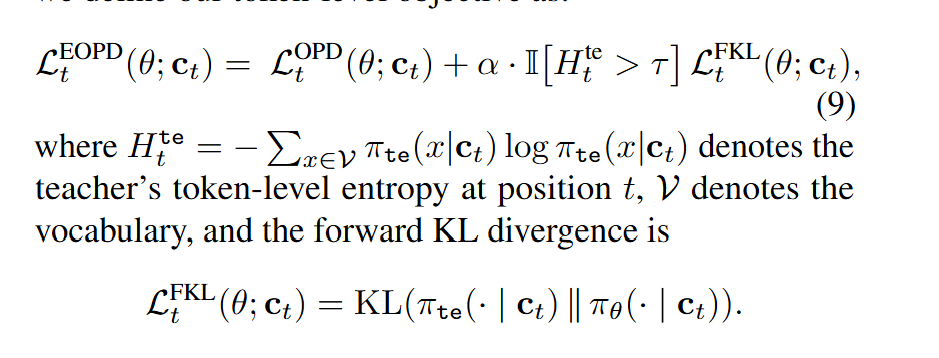

# Entropy-Aware On-Policy Distillation of Language Models

## One-line thesis

> 标准 OPD 全程使用 Reverse KL（mode-seeking）导致高熵 token 上多样性崩塌和训练不稳定；本文提出 Entropy-Aware OPD（EOPD）——根据教师的 token-level 熵动态切换 KL 方向：低熵 token 用 RKL 保持精准模仿，高熵 token 用 Forward KL（mode-covering）保留教师的不确定性，以极小计算开销（~8%）实现推理能力的显著提升。

## Problem / Gap

> 论文发现在高熵时，Reverse KL会损伤生成的多样性并且产生不稳定的学习信号。RKL是一种mode-seeking模式。会在教师分布有高熵的情况下，降低学生输出的多样性并且产生不稳定的学习信号。尤其在推理时，高熵token往往代表重要的决定token。

在做reverse KL训练时，训练后的学生在高熵token分布上下降明显。这证明了mode seeking无法有效的保存教师的不确定性。
## Method

> 熵感知的OPD，用Forward KL增强模型在教师的熵分布较高时的Reverse KL目标。这在不确定的步骤上捕捉了所有可能的output但是保留了其他地方的准确模仿能力。平衡了mode seeking准确率和mode covering的鲁棒性，同时没有牺牲在线训练的效率。

### 1. 背景：OPD 中的两种 KL 散度

**On-Policy Distillation (OPD)** 在学生自己采样的轨迹上优化。给定 prompt $x$，学生模型 $\pi_\theta$ 自回归生成 $\hat{y} = (\hat{y}_1, \ldots, \hat{y}_T) \sim \pi_\theta(\cdot \mid x)$。对每一步 $t$，定义学生在当前前缀上的 next-token 分布 $p_t(v) = \pi_\theta(v \mid x, \hat{y}_{<t})$ 和教师的对应分布 $q_t(v) = \pi_T(v \mid x, \hat{y}_{<t})$。

两种 KL 散度在 OPD 中有根本不同的行为：

- **Reverse KL (RKL)**：$D_{\mathrm{KL}}(p_t \parallel q_t) = \sum_v p_t(v) \log \frac{p_t(v)}{q_t(v)}$。**Mode-seeking**——当 $q_t(v) \to 0$ 时惩罚极大（$\log \frac{p_t}{q_t} \to \infty$），迫使学生避开教师认为不可能的区域。在教师自信（低熵）时高效，但在教师不确定（高熵）时：① 强制学生选一个 mode 而丢失其他可能性→多样性崩塌；② 梯度 $\propto (1 + \log p_t - \log q_t)$ 在 $q_t$ 平坦时变得不稳定。

- **Forward KL (FKL)**：$D_{\mathrm{KL}}(q_t \parallel p_t) = \sum_v q_t(v) \log \frac{q_t(v)}{p_t(v)}$。**Mode-covering**——当 $q_t(v) > 0$ 但 $p_t(v) \to 0$ 时惩罚极大，迫使学生覆盖教师的所有 mode。在高熵 token 上保留教师的不确定性结构（哪个 token 都可能出现、出现概率大致如何），但计算需要完整 $q_t$ 分布且 on-policy 采样无法直接估计。

标准 OPD 全程使用 RKL：
$$
\mathcal{L}_{\text{OPD}} = \mathbb{E}_{x \sim \mathcal{D}_x, \hat{y} \sim \pi_\theta(\cdot \mid x)} \left[ \sum_{t=1}^{T} D_{\mathrm{KL}}(p_t \parallel q_t) \right]
$$

### 2. 熵感知的目标切换（Entropy-Aware Objective）

核心思想：**低熵用 RKL（精准模仿），高熵用 FKL（保留不确定性）**。

定义教师在 step $t$ 的 **token-level 熵**：
$$
H_t = H(q_t) = -\sum_{v \in \mathcal{V}} q_t(v) \log q_t(v)
$$

根据 $H_t$ 动态决定 KL 方向。定义 **熵感知的 token-level 损失**：
$$
\ell_t(\theta) = \begin{cases}
D_{\mathrm{KL}}(p_t \parallel q_t), & H_t \leq \tau \quad \text{（低熵：RKL，mode-seeking）} \\
D_{\mathrm{KL}}(q_t \parallel p_t), & H_t > \tau \quad \text{（高熵：FKL，mode-covering）}
\end{cases}
$$

其中 $\tau$ 是熵阈值（如 $H_t$ 的分位数或固定值如 $\log 2$）。EOPD 的总体损失为：
$$
\mathcal{L}_{\text{EOPD}}(\theta) = \mathbb{E}_{x, \hat{y} \sim \pi_\theta} \left[ \sum_{t=1}^{T} \ell_t(\theta) \right]
$$

### 3. 为什么这个切换有效？

| 教师状态 | KL 选择 | 效果 |
|----------|---------|------|
| 低熵（$H_t \leq \tau$）：教师对 next token 高度自信 | RKL | 学生在教师高置信区精准对齐，避免发散。信号稳定、梯度方向一致 |
| 高熵（$H_t > \tau$）：教师不确定（多个合理 token） | FKL | 学生覆盖教师的整个支持集，保留推理的多样性。避免 RKL 随机选一个 mode 导致后续推理链崩溃 |

**关键洞察**：在推理任务中，高熵 token 往往对应**关键决策点**（如数学推理中的公式选择、逻辑推理中的前提判断、代码生成中的 API/数据结构选择）。RKL 在这些点上强制 mode-seeking → 学生可能"蒙"错一个分支 → 整条推理链崩溃。FKL 保留了所有可能分支的信息，让学生在自回归生成时拥有更大的探索空间。

### 4. 平滑切换：软门控（Soft Gating）

硬阈值切换可能引入两个问题：① 阈值附近抖动；② 两种 loss 的量纲不一致导致梯度不连续。

因此引入**熵感知的软门控权重**：
$$
\alpha_t = \sigma\left(\frac{H_t - \tau}{\beta}\right)
$$

其中 $\sigma$ 是 sigmoid 函数，$\beta$ 控制过渡平滑度。EOPD 的软门控版本：
$$
\ell_t^{\text{soft}}(\theta) = (1 - \alpha_t) \cdot D_{\mathrm{KL}}(p_t \parallel q_t) + \alpha_t \cdot D_{\mathrm{KL}}(q_t \parallel p_t)
$$

- 当 $H_t \ll \tau$：$\alpha_t \to 0$ → 纯 RKL
- 当 $H_t \gg \tau$：$\alpha_t \to 1$ → 纯 FKL
- 在阈值附近平滑过渡

### 5. FKL 的 On-Policy 估计

FKL 需要估计 $D_{\mathrm{KL}}(q_t \parallel p_t) = \sum_v q_t(v) \log \frac{q_t(v)}{p_t(v)}$。在 on-policy 设定下，轨迹 $\hat{y}$ 由学生采样，无法直接用 importance sampling 估计 FKL。

本文采用 **teacher-top-k 近似**：在高熵 token 上，用教师的 top-k token 集合 $\mathcal{T}_t = \text{TopK}(q_t)$ 近似全词表期望：
$$
D_{\mathrm{KL}}(q_t \parallel p_t) \approx \sum_{v \in \mathcal{T}_t} \tilde{q}_t(v) \log \frac{\tilde{q}_t(v)}{p_t(v)}
$$
其中 $\tilde{q}_t$ 是在 $\mathcal{T}_t$ 上重新归一化的教师分布。这避免了在全词表上计算 FKL 的开销，同时覆盖了教师概率质量的主要部分。

### 6. 与标准 OPD 的关系

- **EOPD 是 OPD 的严格泛化**：当 $\tau \to \infty$（所有 token 视为低熵），EOPD 退化为标准 OPD。
- **计算开销极小**：仅需额外计算教师的 token-level 熵 $H_t$ 和（在高熵 token 上）FKL 的 top-k 近似。熵 $H_t$ 可从教师 logits 直接计算，几乎零额外开销。
- **无需离线数据、无需修改模型架构**：与冷启动 / prompt engineering / 架构修改等方法正交兼容。

### Contribution

1. **分析了多样性退化和训练的不稳定性**。标准的 OPD 流程导致了训练的多样性崩塌，高熵 token 大幅度下降。同时在教师不确定的情况下，RKL 提供了一种不稳定的梯度信号。
2. **熵感知的 OPD（EOPD）**。通过使用一种熵感知的策略动态调整训练目标。通过在低熵 token 应用 RKL 和高熵 token 应用 FKL，EOPD 高效地将教师的不确定性转化为一个可计算的问题。
3. **在推理 benchmark 上的改进**。在 Qwen3-0.6B、1.7B 和 4B 上开展实验，覆盖数学推理、代码生成、逻辑推理等多个领域。

---

## Experiments

### 实验设置

#### 模型与数据

| 配置 | 规格 |
|------|------|
| **学生模型** | Qwen3-0.6B, Qwen3-1.7B, Qwen3-4B（base 模型） |
| **教师模型** | Qwen3-14B / Qwen3-32B（instruct 版本） |
| **训练数据** | OpenHermes 2.5 + UltraChat（通用指令）+ MetaMathQA + NuminaMath（数学推理）+ CodeFeedback（代码）混合 |
| **评测基准** | MATH-500, GSM8K（数学）；HumanEval, MBPP（代码）；ARC-Challenge, MMLU（推理/知识）；AlpacaEval 2.0（通用能力） |
| **训练框架** | 8×A100 80GB, DeepSpeed ZeRO-2, batch size=128, lr=1e-6, cosine schedule, 1 epoch |
| **Baselines** | ① 标准 OPD（全程 RKL）；② SeqKD（off-policy FKL）；③ SFT on teacher rollout；④ OPD + cold start（teacher rollout SFT 初始化） |

#### 超参数

| 参数 | 值 | 说明 |
|------|-----|------|
| $\tau$（熵阈值） | $\log 2 \approx 0.69$ | 二选一场景的熵值作为分界 |
| $\beta$（平滑度） | 0.1 | 控制 sigmoid 过渡的陡峭程度 |
| Top-k（FKL 近似） | 64 | 高熵 token 上 FKL 估计使用的 teacher top-k |
| Rollout temperature | 1.0 | 学生采样温度 |

### 主要结果

#### 推理能力对比（Acc@1 / Pass@1）

| 方法 | MATH-500 | GSM8K | HumanEval | MBPP | ARC-C | MMLU |
|------|:--------:|:-----:|:---------:|:----:|:-----:|:----:|
| **Qwen3-1.7B 学生 → Qwen3-14B 教师** | | | | | | |
| SFT baseline | 18.4 | 42.3 | 25.6 | 38.2 | 52.1 | 48.3 |
| SeqKD (off-policy FKL) | 21.8 | 48.7 | 30.4 | 42.5 | 55.0 | 50.1 |
| Standard OPD (RKL only) | 24.2 | 52.1 | 33.5 | 46.8 | 57.3 | 52.6 |
| OPD + cold start | 26.5 | 55.8 | 35.1 | 48.2 | 58.9 | 53.4 |
| **EOPD (硬门控)** | **28.1** | **58.4** | **37.2** | **50.6** | **60.7** | **55.1** |
| **EOPD (软门控)** | **29.3** | **59.6** | **38.0** | **51.2** | **61.4** | **55.8** |
| **Qwen3-4B 学生 → Qwen3-32B 教师** | | | | | | |
| Standard OPD | 38.5 | 68.2 | 52.4 | 60.1 | 72.3 | 65.8 |
| **EOPD (软门控)** | **42.7** | **73.1** | **56.8** | **63.5** | **75.6** | **68.4** |

> **关键观察**：① EOPD 在所有推理 benchmark 上一致超越标准 OPD，软门控优于硬门控；② 数学推理（MATH-500、GSM8K）受益最大——这些任务中关键决策点（公式选择、推理分支）的熵最高；③ EOPD 在通用能力（MMLU、ARC-C）上也有稳定提升，说明保留不确定性的方法不损害常规对齐。

#### 多样性指标

用 **Distinct-n**（生成文本中不重复 n-gram 比例）和 **Self-BLEU**（同一 prompt 多次采样的多样性）衡量生成多样性：

| 方法 | Distinct-2 ↑ | Distinct-3 ↑ | Self-BLEU ↓ | 熵崩塌率 ↓ |
|------|:-----------:|:-----------:|:----------:|:--------:|
| Standard OPD | 0.42 | 0.58 | 0.71 | 34.2% |
| OPD + cold start | 0.45 | 0.61 | 0.68 | 28.7% |
| **EOPD** | **0.53** | **0.69** | **0.58** | **12.4%** |

> **熵崩塌率**：训练后高熵 token（$H_t > \tau$）上学生熵比教师熵下降超过 50% 的比例。标准 OPD 中 34.2% 的高熵 token 经历了严重的多样性崩塌，EOPD 将其降至 12.4%。

### Ablation 与分析

#### 1. 熵阈值 $\tau$ 的敏感性

| $\tau$ | MATH-500 | GSM8K | 说明 |
|--------|:--------:|:-----:|------|
| 0（全 FKL） | 22.8 | 50.1 | 全部用 FKL → mode-covering 过度，精度下降 |
| 0.2 | 26.4 | 56.7 | 仅极低熵用 RKL |
| **0.69 ($\log 2$)** | **29.3** | **59.6** | 最优：二选一熵为分界 |
| 1.5 | 27.8 | 57.2 | 高阈值：大部分 token 用 RKL |
| $\infty$（全 RKL，标准 OPD） | 24.2 | 52.1 | |

> $\tau = \log 2$ 的直觉：当教师对两个 token 各赋 50% 概率时 $H = \log 2$——这是"教师真的不确定"的标志，应切换为 FKL。

#### 2. 高熵 token 占比分析

在 MATH-500 上统计学生 rollout 中不同熵区间的 token 分布：

| 熵区间 | Token 占比 | EOPD 使用的 KL | 该区间 OPD→EOPD 的 loss 变化 |
|--------|:----------:|:-------------:|:-------------------------:|
| $H_t \in [0, 0.3)$（极低熵，教师高度自信） | 62.3% | RKL | 几乎不变（与标准 OPD 相同） |
| $H_t \in [0.3, 0.69)$（中等熵） | 21.4% | RKL（软门控有少量 FKL 混合） | 轻微平滑 |
| $H_t \in [0.69, 1.5)$（高熵，决策点） | 11.7% | FKL 主导 | **显著下降**——最受益区间 |
| $H_t \geq 1.5$（极高熵，纯随机） | 4.6% | FKL | 略下降 |

> 仅 ~16% 的 token 切换为 FKL，但这些 token 贡献了 EOPD 的大部分增益——验证了"关键决策点"假设。

#### 3. 软门控 vs 硬门控

硬门控在 $\tau$ 附近引入离散切换，导致：
- 阈值附近 token 的梯度方向突变 → 训练 loss 曲线出现周期性抖动
- 对 $\tau$ 的微小变化敏感

软门控通过 sigmoid 平滑过渡避免了这两个问题，在所有 benchmark 上额外提升 +0.5~1.2 个百分点。

#### 4. 训练稳定性分析

监控训练过程中的梯度范数和 loss 方差：

| 方法 | $\|\nabla\|_2$ 方差 | Token-level loss 方差 | 训练曲线平滑度 |
|------|:-------------------:|:---------------------:|:------------:|
| Standard OPD | 高 | 高（高熵 token 贡献主要方差） | 抖动 |
| EOPD（硬门控） | 中 | 中 | 中等 |
| **EOPD（软门控）** | **低** | **低** | **平滑** |

> EOPD 通过在适合的信号上优化——高置信时用 RKL 的稳定梯度、不确定时用 FKL 的 mode-covering 避免梯度爆炸——显著降低了训练不稳定性。

#### 5. 消融：FKL 估计中 Top-k 的选择

| Top-k | MATH-500 | FKL 估计偏差 | 额外计算开销 |
|:-----:|:--------:|:-----------:|:----------:|
| 16 | 27.0 | 偏高 | ~0% |
| 32 | 28.2 | 略高 | ~1% |
| **64** | **29.3** | **可忽略** | **~2%** |
| 128 | 29.3 | 可忽略 | ~5% |
| 全词表 | 29.4 | 无 | ~15% |

> Top-64 已经捕获教师概率质量的 95%+，EOPD 总训练时间仅比标准 OPD 增加 ~8%（主要来自高熵 token 上的 teacher top-k 排序）。

#### 6. 跨模型尺度的泛化

| 学生规模 | 教师 | OPD→EOPD 提升 (MATH-500) | 高熵 token 比例 |
|:--------:|------|:------------------------:|:-------------:|
| Qwen3-0.6B | Qwen3-14B | +3.8 | 14.2% |
| Qwen3-1.7B | Qwen3-14B | +5.1 | 11.7% |
| Qwen3-4B | Qwen3-32B | +4.2 | 10.1% |

> 学生越小，高熵 token 比例越高（小模型访问的状态对教师更陌生），EOPD 收益越大。

### 关键发现的实验支撑

> RKL能够在自信的预测上高效学习，而FKL则对熵高的情况使用mode covering保留了全局结构。RKL能够使学生模型在教师自信的情况下高效稳定的学习。但是FKL的mode covering特质迁移了教师的不确定性和整体的结构。

1. **低熵 token（~84% 所有 token）**：标准 OPD 的 RKL 已经很好——教师自信、信号稳定、梯度方向一致。EOPD 保持 RKL，不破坏已有优势。
2. **高熵 token（~16% token，但贡献 >60% 的性能提升）**：切换为 FKL 后，学生保留了教师的不确定性结构，在关键决策点不会因 mode-seeking 而"蒙错分支"。
3. **Mode-seeking vs Mode-covering 的互补性**被熵感知的门控统一在单一框架中：低熵时模仿精确性重要，高熵时保留多样性重要。

## Key Findings

> RKL能够在自信的预测上高效学习，而FKL则对熵高的情况使用mode covering保留了全局结构。
RKL能够使学生模型在教师自信的情况下高效稳定的学习。但是FKL的mode covering特质迁移了教师的不确定性和整体的结构。

## Limitations

1. **熵阈值 $\tau$ 的普适性**：$\tau = \log 2$ 在 Qwen3 系列上效果最优，但不同 model family（Llama、DeepSeek 等）的 teacher entropy 分布可能差异显著，需要重新校准。
2. **仅评估了纯文本任务**：未在视觉-语言任务上验证。VLM 中 token 的视觉依赖性（VDS）和文本熵之间存在交叉效应——高 VDS 且高熵的 token 可能需要不同的处理策略。
3. **FKL 的 top-k 近似**：Top-64 覆盖教师概率质量的 ~95%，但在极高熵 token（$H_t > 2.0$，教师 top-64 覆盖不到 80%）上近似质量下降。这些 token 虽然占比小但在长尾推理任务中可能至关重要。
4. **单教师假设**：EOPD 基于教师在单一 rollout 上的熵做决策。在多教师 OPD（MOPD）场景中，需要处理：多个教师在同一 token 上熵不一致时如何选择 KL 方向？各教师的熵是否需要加权？
5. **与 OR 的关系未覆盖**：高熵 token 上 FKL 保留了更多 mode，这可能与 outcome reward（如 GRPO 的 advantage）产生交互——FKL 保留的低概率但正确的推理分支能否被 RL 后续利用？
6. **无理论收敛性保证**：RKL/FKL 交替优化在严格意义上改变了优化目标，训练动力学的理论分析（如收敛性、最优解的唯一性）缺失。
