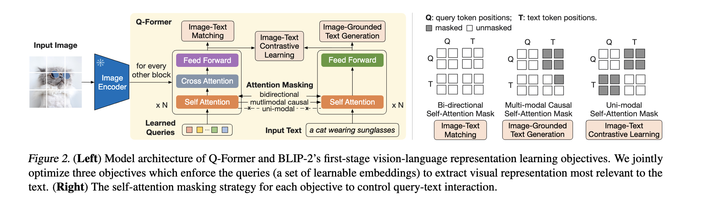

# BLIP-2: Bootstrapping Language-Image Pre-training with Frozen Image Encoders and Large Language Models

## One-line thesis

BLIP-2 proposes a generic and compute-efficient vision-language pre-training strategy that bootstraps from frozen pre-trained image encoders and frozen LLMs via a lightweight Querying Transformer (Q-Former), achieving state-of-the-art results with far fewer trainable parameters.

## Problem / Gap

Vision-language pre-training (VLP) had become increasingly prohibitive due to end-to-end training of ever-larger models. Prior methods required expensive end-to-end training of both vision and language components. While leveraging frozen unimodal pre-trained models (image encoders, LLMs) was appealing, aligning their feature spaces — especially when the LLM has never seen images — remained a key challenge. Existing modular approaches (Frozen, Flamingo) used only image-to-text generation loss, which proved insufficient to bridge the modality gap.

## Method

- 用一组可学习的query向量，从视觉token中学习到LLM需要的信息，然后使得下游的LLM能够理解图片中的内容
- 对于是否匹配的二分类任务，图片和文本信息自由流动，完整的交互判断是否匹配。
- 对于对齐训练，遮住相互之间的注意力使得模型只能关注到自己是什么，然后尽量让文本和图像在嵌入空间对齐
- 对于text generation，使用自回归范式，需要遮住后文进行训练。

BLIP-2 introduces a **Querying Transformer (Q-Former)** — a lightweight 188M parameter transformer with 32 learnable query tokens that acts as an information bottleneck between a frozen image encoder and a frozen LLM. The pre-training has two stages:

1. **Stage 1 — Vision-Language Representation Learning**: Q-Former is connected to a frozen image encoder and jointly optimized with three objectives: Image-Text Contrastive Learning (ITC), Image-grounded Text Generation (ITG), and Image-Text Matching (ITM). Different attention masking strategies control query-text interaction.

2. **Stage 2 — Vision-to-Language Generative Learning**: The Q-Former output is connected to a frozen LLM (OPT or FlanT5). The Q-Former is trained so its output visual representations can be interpreted by the LLM for text generation.

The query bottleneck (32×768) forces the model to extract visual information most relevant to the text, making the approach highly compute-efficient.

## Key Results

- Outperforms Flamingo80B by 8.7% on zero-shot VQAv2 with **54x fewer trainable parameters**
- State-of-the-art on various vision-language tasks: visual question answering, image captioning, image-text retrieval
- Demonstrates zero-shot image-to-text generation following natural language instructions (visual knowledge reasoning, visual conversation)
- Works with both decoder-only LLMs (OPT) and encoder-decoder LLMs (FlanT5)
- Generic framework — can harvest more advanced unimodal models for better VLP performance

## Assumptions

- Frozen pre-trained unimodal models (image encoders and LLMs) provide sufficiently high-quality features that can be aligned through a lightweight bottleneck
- The Q-Former's 32 learnable queries are sufficient to capture all visual information relevant to text
- Two-stage pre-training (representation learning → generative learning) is necessary and sufficient for effective modality alignment
- Catastrophic forgetting is avoided by keeping unimodal models frozen

## Limitations / Failure Modes

- The Q-Former adds architectural complexity and an extra pre-training phase compared to end-to-end methods
- Performance is upper-bounded by the frozen image encoder and LLM quality — better unimodal models are needed for gains
- The fixed 32-query bottleneck may limit information flow for complex visual understanding tasks
- Two-stage pre-training requires careful scheduling and hyperparameter tuning
- Dependence on availability of high-quality frozen pre-trained unimodal models

## Reusable Ingredients

- Q-Former architecture with learnable query tokens as an information bottleneck between vision and language
- Two-stage bootstrapping strategy (representation learning → generative learning)
- Three-objective joint optimization (ITC + ITG + ITM) with attention masking
- Generic framework for composing any frozen image encoder with any frozen LLM
- Computationally efficient VLP recipe (SOTA with far fewer trainable parameters)

## Open Questions

- How does the 32-query bottleneck scale with more complex vision-language tasks?
- Can the two-stage pre-training be unified into a single stage?
- How does Q-Former compare with cross-attention layers (Flamingo) at extreme scales?

## Claims

## Connections

- **Extends:** `paper:radford2021_clip` (CLIP — uses frozen CLIP image encoders and builds on contrastive VLP)
- **Extends:** `paper:dosovitskiy2021_vit` (ViT — uses ViT-based frozen image encoders as visual backbones)

## Relevance to This Project

BLIP-2 represents the state-of-the-art in efficient vision-language pre-training, directly relevant to VLM research. It shows how to effectively combine frozen vision encoders (like ViT, CLIP) with LLMs — a paradigm central to modern VLM design.
