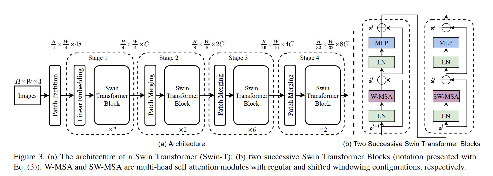

# Swin Transformer: Hierarchical Vision Transformer using Shifted Windows

## One-line thesis

- Swin Transformer introduces a hierarchical Transformer architecture with shifted window self-attention that achieves linear computational complexity with respect to image size, enabling it to serve as a general-purpose backbone for both image classification and dense prediction tasks (detection, segmentation).
- 使用滑动窗口，减轻了不重叠的窗口之间可能包含的信息，增强了对多窗口信息之间联系的理解。具有良好的scale up能力，并且降低计算复杂度到线性。（ViT关注的是全局注意力，Swin Transformer的先验假设是小窗口内的需要优先关注，然后再是大的）

## Problem / Gap

Previous vision Transformers (ViT) produce single-resolution feature maps and have quadratic self-attention complexity with respect to image size. This makes them unsuitable for dense prediction tasks like object detection and semantic segmentation, where multi-scale features are essential and high-resolution inputs exacerbate the quadratic cost. ViT also struggles to capture visual elements at varying scales. The challenge was to design a Transformer backbone that can serve as a general-purpose vision backbone like CNNs (ResNet) do, compatible with existing dense prediction frameworks such as FPN and U-Net.
- 图片信息在规模和分别率上有很大不同，先前的工作使用一个统一的scale，对不同场景下的目标检测任务效果不好。这种改进是的图像适用于多样化的分辨率问题
## Method

Swin Transformer introduces several key innovations over ViT:

- **Hierarchical feature maps**: Starting from small 4×4 patches, neighboring patches are gradually merged in deeper layers (via patch merging layers), producing feature maps at 4×, 8×, 16×, and 32× downsampling ratios — analogous to the multi-scale feature pyramid in CNNs like ResNet.

- 先小patch再逐步扩大，得到对于全局的感知。

- **Shifted window attention (Swin)**: Self-attention is computed within non-overlapping local windows (default 7×7 patches). Between consecutive Transformer blocks, the window partition is shifted ((⌊M/2⌋, ⌊M/2⌋) pixels), enabling cross-window connections. This yields O(M²hwC) complexity — **linear** in image size hw — versus O((hw)²C) for global self-attention.

- 滑动窗口其实是主要参考了CNN的**inductive bias**，使用了平移不变性，相邻的窗口如果连在一起应该能取得相同的效果。使用注意力机制进行更新之后，序列的信息$\text{Attention}(Q, K, V) = \text{softmax}\left(\frac{QK^T}{\sqrt{d_k}}\right)V$主要是对窗口内的上下文信息进行了更新。那么滑动之后对于相邻的上下文信息也会进行一个处理和更新。这样长程的注意力也会在逐步传播之后更新。

- **Efficient batch computation**: A cyclic-shifting technique ensures that the number of batched windows remains the same between regular and shifted configurations, avoiding the 2.25× computation blow-up of naive padding.

- **Relative position bias**: The model uses learnable relative position biases B̂ ∈ R^(2M−1)×(2M−1) per attention head, which improve accuracy over absolute position embeddings.相对位置编码通过在窗口内的token对之间管理，有效的关注到了不同token之间的关系，实验显著优于绝对位置编码。（为啥ViT一维就好，swinT使用相对的更好？）

Architecture variants: Swin-T (tiny), Swin-S (small), Swin-B (base), Swin-L (large), with channel sizes C = 96/96/128/192 and layer counts {2,2,6,2} / {2,2,18,2} / {2,2,18,2} / {2,2,18,2}.

## Key Results

- **Image classification**: Swin-B achieves 84.5% top-1 on ImageNet-1K (384² input, regular training). With ImageNet-22K pre-training: Swin-L achieves 87.3% top-1, surpassing ViT-L's 85.2% with 2.6× higher throughput.

- **Object detection (COCO)**: Swin-L (HTC++) achieves 58.7 box AP and 51.1 mask AP on COCO test-dev, surpassing previous SOTA by +2.7 box AP and +2.6 mask AP. Under standard Cascade Mask R-CNN, Swin-T surpasses ResNet-50 by +3.4~4.2 box AP consistently across four different detection frameworks.

- **Semantic segmentation (ADE20K)**: Swin-L (UperNet) achieves 53.5 mIoU, outperforming previous SOTA (SETR) by +3.2 mIoU.

- **Linear complexity**: The window-based self-attention has linear computational complexity to image size, making high-resolution dense prediction tractable.

## Assumptions

- Hierarchical feature maps (multi-scale) are essential for general-purpose vision backbones.
- Local window self-attention combined with cross-window connections is sufficient for modeling visual relationships.
- The 7×7 window size balances efficiency and modeling power; relative position bias handles positional information effectively.
- The patch merging strategy (2×2 → 4× downsampling per stage) provides a useful inductive bias.

## Limitations / Failure Modes

- Window-based self-attention is still limited in capturing extreme long-range dependencies across very distant image regions.
- The cyclic-shift and masking implementation adds engineering complexity compared to standard ViT or CNNs.
- Throughput vs. FLOPs gap: Swin Transformer operations are less hardware-optimized than CuDNN-based ResNets, so theoretical FLOPs advantages may not fully translate to wall-clock speed on all hardware.
- Relative position bias is learned per head, adding parameter count and requiring re-interpolation for different window sizes.
- The fixed window size (M=7) is a hyperparameter that may not be optimal for all tasks or image resolutions.

## Reusable Ingredients

- Shifted window attention as a general replacement for global self-attention in vision Transformers.
- Hierarchical patch merging strategy for building multi-scale Transformer feature maps.
- Cyclic-shift efficient batch computation for shifted window partitioning.
- Relative position bias paradigm for window-based attention.
- Architectural design validated as a general-purpose backbone for classification, detection, and segmentation.
- The approach also benefits all-MLP architectures (e.g., MLP-Mixer).

## Open Questions

- Can shifted window attention be made adaptive to input content rather than using a fixed grid?
- How does Swin Transformer compare to later advances like ConvNeXt that re-explore CNN designs?
- Can the window-based attention be further optimized for hardware to close the FLOPs/latency gap?
- Is there an optimal hierarchical structure beyond 4-stage / 2× downsample?

## Connections

- **Extends:** `paper:dosovitskiy2021_vit` (ViT — addresses ViT's single-scale and quadratic complexity limitations via hierarchical feature maps and shifted window attention; explicitly compared throughout the paper)

## Relevance to This Project

Swin Transformer is a critical evolution of vision Transformers that made them practical for dense prediction tasks. Many modern VLMs use Swin Transformer as a backbone when multi-scale visual features are needed (e.g., for detecting objects at different scales in image-text tasks). It bridges the gap between Transformer architectures and the hierarchical feature pyramid paradigm of CNNs.
