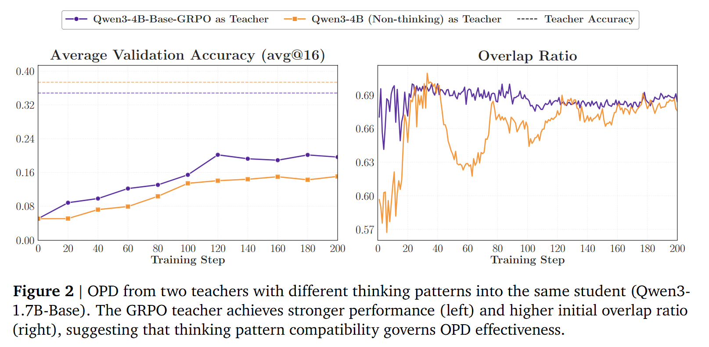

# Rethinking On-Policy Distillation of Large Language Models: Phenomenology, Mechanism, and Recipe

## One-line thesis

> OPD 的成败不只取决于 teacher 的 benchmark 分数，而取决于 teacher 在 student rollout 访问到的局部 token 状态上，是否能提供可靠、方向一致、且 student 可利用的监督信号；这种可利用性主要由 teacher-student thinking pattern overlap、teacher 是否提供新能力、prompt 分布是否贴近 teacher 后训练数据决定。

## Problem / Gap

虽然OPD已经得到广泛应用，但是很少有人研究为什么更好的模型完全不能优化学生模型，而弱一些的模型可以在初始对齐度更低的情况下成功。

### 问题设定：prompt、response 与 next-token distribution

令输入 prompt 为 $x = (x_1, \ldots, x_n)$，模型回复为 $y = (y_1, \ldots, y_m)$，并记 $y_{<t} \triangleq (y_1, \ldots, y_{t-1})$ 表示到第 $t$ 步之前的回复前缀。论文考虑两个 LLM：学生模型 $\pi_\theta$ 和教师模型 $\pi_T$；二者都会在词表 $\mathcal{V}$ 上定义一个 next-token distribution $\pi(\cdot \mid x, y_{<t})$，也就是给定输入 prompt $x$ 和当前已经生成的前缀 $y_{<t}$ 时，模型对下一个 token 的概率分布。记 $y \sim \pi_\theta(\cdot \mid x)$ 表示回复 $y$ 是由学生模型 $\pi_\theta$ 根据 prompt $x$ 自回归采样生成的。固定数据集记为 $\mathcal{D} = \{(x^{(i)}, y^{(i)})\}_{i=1}^{N}$，其中 response 是教师模型生成的输出；对应的 prompt 集合记为 $\mathcal{D}_x = \{x^{(i)}\}_{i=1}^{N}$。知识蒸馏（KD）的目标是通过最小化教师模型 $\pi_T$ 和学生模型 $\pi_\theta$ 这两个分布之间的差异，把知识从教师模型转移到学生模型。一种标准做法是使用 KL 散度。对于定义在词表 $\mathcal{V}$ 上的两个分布 $P$ 和 $Q$，KL 散度定义为 $D_{\mathrm{KL}}(P \parallel Q) = \sum_{v \in \mathcal{V}} P(v)\log\frac{P(v)}{Q(v)}$。直观地说，KL 散度衡量的是：如果真实分布是 $P$，但用 $Q$ 去近似它，会产生多大的信息损失。

## Method

### On-Policy Distillation objective

OPD 在当前学生模型 $\pi_\theta$ 采样得到的轨迹上计算监督信号。给定 prompt $x \sim \mathcal{D}_x$，学生模型采样一个回复 $\hat{y} = (\hat{y}_1, \ldots, \hat{y}_T) \sim \pi_\theta(\cdot \mid x)$，其中 $T \triangleq |\hat{y}|$ 表示 rollout 长度。随后，学生模型和教师模型都会在学生生成的前缀 $\hat{y}_{<t}$ 上被评估，从而在每一步 $t$ 得到两个 next-token distributions：$p_t(v) \triangleq \pi_\theta(v \mid x, \hat{y}_{<t})$ 和 $q_t(v) \triangleq \pi_T(v \mid x, \hat{y}_{<t})$，其中 $v \in \mathcal{V}$。标准 OPD 形式是在学生生成的轨迹上最小化 sequence-level reverse KL：

$$
\mathcal{L}_{\mathrm{OPD}}(\theta)
= \mathbb{E}_{x \sim \mathcal{D}_x}
\left[
D_{\mathrm{KL}}
\left(
\pi_\theta(\cdot \mid x)
\parallel
\pi_T(\cdot \mid x)
\right)
\right]
$$

利用自回归分解，上面的 sequence-level objective 可以精确分解为 token-level KL：

$$
\mathcal{L}_{\mathrm{OPD}}(\theta)
= \mathbb{E}_{x \sim \mathcal{D}_x, \hat{y} \sim \pi_\theta(\cdot \mid x)}
\left[
\sum_{t=1}^{T}
D_{\mathrm{KL}}(p_t \parallel q_t)
\right]
$$

实践中，不同 OPD 实现主要区别在于如何计算这个逐 token 的 reverse KL：full-vocabulary OPD 直接优化上式；sampled-token OPD 对每个 token-level KL 项使用无偏 Monte Carlo 估计；top-k OPD 则用基于子集的近似替代 full-vocabulary KL。

 
- 采样OPD: 最轻量化的变种，仅仅评估学生采样的token，也是目前最广泛应用的工作。对于采样的序列 $\hat{y}$ 损失函数loss的计算式为 $log \frac {p_t(\hat{y})}{q_t(\hat{y})}$

- 全词表OPD: 对整个词表进行OPD

- Top-k OPD: 只对学生采样中的top-k个词进行计算KL散度

### 📊 动态指标 (Dynamic Metrics)

我们定义学生（Student）和教师（Teacher）模型在步骤 $t$ 时的 **Top-k 集合** 分别为 $S_t^{(p)}$ 和 $S_t^{(q)}$。在后续的实验中，将监控以下指标。

#### 1. 重叠率 (Overlap Ratio)
该指标量化了学生和教师候选空间（candidate spaces）之间的对齐程度。它被定义为同时出现在学生和教师 Top-k 集合中的 Token 的平均占比。

$$
 \mathcal{M}_{\text{overlap}} \triangleq \mathbb{E}_t \left[ \frac{|S_t^{(p)} \cap S_t^{(q)}|}{k} \right] 
$$

> **翻译与解释**：低重叠率表明学生模型的概率质量集中于与教师不同的 Token 集合上，暗示可能存在显著的概率分布分歧或“模式不匹配”（mode mismatch）。反之，当重叠率接近 1.0 时，说明学生模型已经成功定位到了教师模型的支持区域。

#### 2. 重叠 Token 优势 (Overlap-Token Advantage)
为了测量**重叠 Token 集合内部**的分布一致性，定义了 $A_t(v)$，其中 $\tilde{p}_t$ 和 $\tilde{q}_t$ 是在 $S_t^{(p)} \cap S_t^{(q)}$ 上重新归一化后的学生和教师分布。该指标取这一量的均值：

$$
 \mathcal{M}_{\text{adv}} \triangleq \mathbb{E}_t \left[ \frac{1}{|S_t^{(p)} \cap S_t^{(q)}|} \sum_{v \in S_t^{(p)} \cap S_t^{(q)}} A_t(v) \right]  
$$

> **翻译与解释**：当该值接近 0 时，表明学生模型在教师偏好的 Token 上赋予了适当的置信度，实现了高质量的对齐。相反，较大的负值则意味着在重叠的 Token 集内部，学生模型表现出了**过度自信（overconfident）**（即学生的高置信度 $p_t$ 对比教师的低置信度 $q_t$）。

#### 3. 熵与熵差 (Entropy and Entropy Gap)
为了监测分布的特性，我们追踪学生模型 $H(p_t)$ 和教师模型 $H(q_t)$ 两者的**熵**，并将**熵差**定义为：

$$
 \Delta H_t = |H(q_t) - H(p_t)| 
$$

> **翻译与解释**：$\Delta H_t$ 是一种**状态特异性**的模态对齐指标。较大的熵差表明学生在置信度和多样性上与教师存在显著的不匹配。随着训练收敛，该值趋近于 0，意味着学生模型成功地匹配了教师模型在其生成的轨迹上的**不确定性分布（uncertainty profile）**。
> 离线冷启动和教师对齐的prompt选择。
> 1. 离线冷启动，让学生模型在教师生成的rollouts上进行冷启动，使得学生模型能与教师模型的思维模式进行对齐。
> 2. 教师prompt选择，用教师模型的后训练数据加强和教师模型的对齐能力。但是这也降低了模型在分布外prompt的熵值。

## Key Results

- **渐进式对齐**。OPD训练中，教师和学生的重叠topk的token逐渐稳定增加，而失败的OPD训练重叠的token有限
- **重叠充分性** 几乎所有的优化效果在重叠部分的top-k的token中出现，只有这些token能够对OPD训练贡献
因此提出了两个方法：

### **离线冷启动策略** 
先用教师模型在数据集上rollout大量的回复，而这些teacher的rollout作为学生模型冷启动的SFT样本。
### **对齐教师的prompt**
“Leveraging Teacher Post-Training Prompts” 不是在说改 teacher 的 system prompt，而是在说 OPD 训练时选 prompt 数据和模板要尽量贴近 teacher 后训练时见过的分布；这样 teacher 的 token-level 分布更可靠，学生更容易学到有效信号，但不能过度依赖，否则会压低 entropy、损害泛化。

更具体地说，OPD 中 teacher 和 student 使用的是**同一个 prompt**。流程是：从数据集中取 prompt $x$，student 基于 $x$ rollout 出 $\hat{y}$，然后 teacher 和 student 都在同一个条件 $(x, \hat{y}_{<t})$ 下计算 next-token distribution。所谓 teacher-aligned prompt，是让这个共同使用的 $x$ 在模板或内容上更接近 teacher 后训练时见过的分布，而不是给 teacher 和 student 分别使用两套 prompt。

论文里有两层实验：

- **Prompt template alignment**：题目内容不变，只换成 teacher 熟悉的模板。结果是 validation accuracy 和 overlap ratio 都提升，说明模板会改变 student rollout 与 teacher supervision 的兼容性。
- **Prompt content alignment**：题目来源也贴近 teacher 后训练数据。结果是性能提升、overlap-token probability mass 更集中，但 student entropy 明显下降。

因此，teacher-aligned prompts 是一种降低 distribution mismatch 的工具，但不是越多越好。只使用 teacher post-training prompts 会让 student 过度贴近 teacher 熟悉分布，压低策略熵；更稳的做法是混合 teacher-aligned prompts 和分布外 prompts。

**失效的7B教师模型并未产生更弱的全局信号。**7B教师每个token的优势虽然单独来看很大，但在每个序列中的不同位置是各向异性的。当这些异质信号聚合成梯度更新时，它们会部分抵消，导致尽管每个token的奖励很大，有效梯度却很小。相比之下，与学生的思维模式兼容的JustRL-1.5B可能将其优势集中在更连贯的token子集上。由此产生的梯度，虽然由较小的每个token信号组成，但指向一致的方向，反向KL可以通过其模式寻求行为放大该方向。

## Assumptions

分析OPD成功或者失败的两个因素。

### 思维模式一致性
1. 学生模型和教师模型应该具有兼容的思考模型。（topk采样时最好在token分布高度重叠）如果思考模式不匹配，即使更高得分的模型也无法很好提升学生模型能力
作者使用qwen3-1.7B作为学生模型，qwen3-4B-nothink和qwen3-4B-GRPO作为教师模型，期望是因为base模型是nothink，学生模型会在GRPO版本学习到更好的分布。

### 新知识而不只是规模上的提升
2. 即使二者思维模式一致、教师得分更高，教师也必须提供学生在训练中尚未见过的真正新能力。如果教师模型和学生模型都是在同样的数据集上训练的，在对应的领域内会有相近的分布，导致学生能学习到极少的信号。
成功的OPD是以在学生高概率visit的token空间提供对齐来实现的，这部分token旨在词表中占据一小部分，但是覆盖了绝大部分的情况。也有新的使用自己作为教师模型的方法--OPSD
实验中使用相同模型，在新的数据集上做RL的模型最终在能力提升上比没有RL过的模型效果更好。此外定义gap recovery rate。更强的教师模型，学生模型能够相对学到的内容也更多

## Limitations / Failure Modes

密集的token level的reward不一定能够在长程任务表现良好。在推理深度提升时，reward的质量下降并且后续的token出现不稳定性。令人惊讶的是，即使失败的教师模型也能提供与 rollout 正确性全局相关的奖励信号，这表明失败并非源于信号质量，而是源于局部优化几何结构。
不确定性主要来源于后续token。高熵首先出现在响应的末尾，并随着训练进行逐渐向前传播至更早的token。教师熵也表现出类似的后缀到前缀趋势，这与教师在后续位置遇到越来越陌生的前缀，从而产生更嘈杂的奖励，进而使学生不稳定的现象一致。
全局丰富的奖励信息不保证局部的可利用性。

## Reusable Ingredients

- 对于OPD，需要关注教师模型与学生模型之间的thinking patterns。OPD训练会主动获取教师模型的思维模式，并覆盖学生的思维模式。基准测试和更高的分数不代表OPD能够获得新的知识，教师模型应当具有训练过程中尚未见过的知识。

## Open Questions

- OPD 的 overlap / entropy 指标能否直接推广到多模态监督？在 VLM 中，文本 token 的 overlap 高不等于视觉证据正确，因此还需要检查视觉 grounding 是否正确。
- Teacher-aligned prompt 会提高 single-teacher OPD 的有效性，但 multi-teacher OPD 中可能引入新的偏置：如果 visual teacher、knowledge teacher、reasoning teacher 的后训练 prompt 分布不同，贴近某一个 teacher 的 prompt 可能会削弱另一个 teacher 的监督质量。
- OPD 论文主要讨论 teacher-student compatibility；多教师场景还需要 teacher-teacher compatibility。即多个 teacher 在同一 student prefix 上是否给出一致的能力信号。
- 如果有效信号主要来自 overlap token，那么多教师蒸馏中应该如何定义“有效 overlap”？是 student 与每个 teacher 的 overlap，还是多个 teacher 共同支持的 overlap，还是由任务能力决定的局部 overlap？

## Claims

- **Claim 1：更强 teacher 不必然是更好 teacher。** 如果 teacher 的 reasoning style / thinking pattern 与 student 当前 rollout 状态不兼容，teacher 的 token-level KL 信号可能局部不可利用。
- **Claim 2：OPD 的有效信号主要来自 overlap support。** teacher 和 student top-k token 集合的重叠区域承载主要优化收益；非重叠区域往往对应模式错配或难以利用的监督。
- **Claim 3：prompt distribution 是 OPD 目标的一部分。** prompt 模板和内容会同时改变 student rollout 与 teacher 在该 rollout 上的监督质量。teacher-aligned prompts 可以提升 OPD，但存在压低 entropy 的风险。
- **Claim 4：全局 reward / teacher quality 不保证局部梯度有效。** 即使 teacher 的奖励信号与 rollout correctness 全局相关，逐 token 信号在不同位置可能各向异性、互相抵消，导致有效梯度很小。
- **Claim 5：这些结论在 MOPD 中更强。** Single-teacher OPD 只需要 student 与一个 teacher 局部兼容；multi-teacher OPD 还要求多个 teacher 之间在同一 student-visited state 上不产生能力冲突。

## Connections

- **MOPD:** OPD 论文解释了 single-teacher OPD 为什么需要 teacher-student compatibility；MOPD 把问题扩展成多个 teacher 的 capability integration。若多个 teacher 在同一 student prefix 上给出不一致分布，固定加权 KL 可能把“能力整合”变成“监督冲突”。
- **CaMOPD:** CaMOPD 关注 recovery / preservation 之间的 counteraction；这篇 OPD 论文提供了更底层的解释框架：counteraction 不只是任务级别冲突，也可能来自 token-level local geometry。
- **OPSD / self-distillation:** OPD 论文强调 teacher 必须提供 student 尚未掌握的新能力；这对 self-distillation 特别关键，因为同源 teacher 很容易只重复 student 已有分布。
- **VLM dense supervision:** 在 VQA / multimodal reasoning 中，token-level KL 同时包含答案、格式、推理风格、视觉描述习惯。OPD 的 overlap 指标可以作为诊断起点，但不能替代视觉证据层面的 correctness。

## Relevance to This Project

这篇 OPD 论文对我们的思路最重要的价值是：它把“OPD 失败”从 teacher 分数问题转成了**局部监督几何问题**。teacher 是否有用，取决于它在 student 当前访问的状态上给出的 next-token distribution 是否与 student 有足够 overlap，并且是否携带 student 尚未掌握的新能力。

放到我们的 VLM / MOPD 思路里，核心迁移是：

1. **从 single-teacher compatibility 到 multi-teacher compatibility。** OPD 要求 student 和 teacher 的 thinking pattern 对齐；MOPD 还要求多个 teacher 之间不要在同一 token 上给出互相抵消的能力信号。
2. **从 prompt alignment 到 capability alignment。** Teacher-aligned prompt 能提升 single-teacher OPD，是因为 prompt 让 teacher 回到熟悉分布。多教师时不能简单让所有样本贴近某一个 teacher 的后训练分布，否则可能牺牲另一个 teacher 的能力信号。
3. **从 overlap sufficiency 到 conflict diagnosis。** 如果有效训练信号主要来自 overlap tokens，那么多教师 setting 中最需要看的不是全词表 KL 均值，而是 capability-relevant token 上 visual / knowledge / reasoning teacher 的 top-k overlap、probability mass 和梯度方向。
4. **从 entropy risk 到泛化风险。** Teacher-aligned prompts 会压低 student entropy；在 VLM 中，如果训练过度贴近某类 teacher 的模板，student 可能学会固定回答风格，却降低对开放视觉证据和分布外问题的适应能力。

因此我们的表述应该避免写成“OPD 不好”或“KL 只学风格”，而应写成：

> Dense multi-teacher OPD in VLMs requires capability-compatible token-level supervision. The failure mode is not merely style drift, but that visual, knowledge, and reasoning teachers may assign incompatible local supervision on the same student-visited states; prompt/template alignment can reduce one source of mismatch, but cannot solve teacher-teacher capability conflict.

## Reading Notes

### 核心概念

- **Student-visited state:** OPD 的监督不是在 teacher 自己生成的轨迹上计算，而是在 student rollout 的 prefix 上计算。这使 OPD 更贴近 student 当前策略，但也让 teacher 可能被迫评价自己不熟悉的状态。
- **Overlap support:** teacher 和 student top-k token 集合的交集。论文认为成功 OPD 的主要收益来自这个交集，而不是来自全词表中大量低概率 token。
- **Entropy profile:** teacher 和 student 的不确定性形状。只看 accuracy 不够，teacher 过尖或 student 过尖都会影响 KL 信号。
- **Teacher-aligned prompt:** student 和 teacher 共用同一个 prompt，只是这个 prompt 的模板或内容贴近 teacher 后训练分布。

### 机制理解

OPD 可以理解成“student 在自己会走到的地方向 teacher 问路”。如果 student 走到的状态仍在 teacher 熟悉的局部区域，teacher 的 next-token distribution 就能提供密集、可用的方向；如果 student 走到 teacher 不熟悉的状态，teacher 仍然可能全局更强，但局部 token-level 分布不一定能形成稳定优化信号。

这解释了两个表面矛盾：

- 更强 teacher 可能失败：强 teacher 的 reasoning style 与 student 当前 rollout 差异过大，top-k support 不重叠，KL 信号难以转化为有效更新。
- 弱一些但更兼容的 teacher 可能成功：它的 token distribution 与 student 更重叠，局部监督更容易被吸收。

Prompt alignment 是从数据侧缓解这个问题：让 student rollout 和 teacher evaluation 都发生在 teacher 更熟悉的 prompt 分布上，从而提高 overlap 和 supervision reliability。

### Recipe / 实践细节

- OPD 训练前可以先做 teacher rollout SFT 冷启动，使 student 初始 thinking pattern 靠近 teacher，避免一开始 overlap 太低。
- 训练 prompt 不只看任务领域，还要看 template / content 是否贴近 teacher 后训练数据。
- 不要只用 teacher post-training prompts；混入分布外 prompts 以防 student entropy 被压低。
- 监控指标至少包括：top-k overlap ratio、overlap-token probability mass、student/teacher entropy、entropy gap。
- 对 VLM/MOPD，额外需要按能力 segment 或内容 token 统计这些指标，例如视觉实体 token、属性 token、外部知识 token、推理连接 token。

### 值得复现或借鉴的实验

- **Prompt template ablation:** 同一批问题，只换 prompt 模板，观察 OPD accuracy、overlap ratio、entropy 是否变化。迁移到 VLM 时，可以比较通用 VQA 模板、visual-grounding 模板、knowledge-reasoning 模板。
- **Prompt content ablation:** 同样任务领域内，比较 teacher 后训练 prompt 分布与去重后的外部分布。关键不是只看 accuracy，而是看 overlap-token mass 和 entropy 是否变尖。
- **Cold-start ablation:** 比较 base student 直接 OPD 与 teacher rollout SFT 后再 OPD。若冷启动显著提高 overlap，说明 failure 来自 thinking-pattern mismatch。
- **Long-depth reward degradation:** 在长推理链上检查 teacher token-level reward 是否随 response depth 降低。这对 VLM 多步推理尤其重要，因为视觉证据错误可能在早期被引入，后续 token KL 只能放大错误链。

### 和 MOPD / 多教师蒸馏的关系

OPD 论文可以视为 MOPD 的前置诊断：如果单个 teacher 都需要和 student 在 local support 上对齐，那么多个 teacher 的 KL 信号更不应该被默认视为可加。

在多教师 VLM 中，可以把每个 token 位置看成同时存在三种关系：

1. **student-visual teacher overlap**：visual teacher 是否在该 token 上提供可靠 grounding 监督。
2. **student-knowledge / reasoning teacher overlap**：knowledge 或 reasoning teacher 是否在该 token 上提供可靠语义监督。
3. **teacher-teacher compatibility**：不同 teacher 的 top-k support 和高概率 token 是否一致。

如果第 3 点失败，固定权重 MOPD 会出现两类问题：

- **稀释有效信号**：视觉 token 上 reasoning teacher 的低信息分布稀释 visual teacher；推理 token 上 visual teacher 稀释 reasoning teacher。
- **反向梯度冲突**：两个 teacher 在同一内容 token 上把 student 推向不同方向，KL 加权后得到模糊 target，既不像 visual teacher，也不像 reasoning teacher。

因此，可以把 OPD 的 recipe 改写成 MOPD/VLM 的 recipe：

- 先诊断每个 teacher 与 student 的 overlap，而不是直接训练。
- 再诊断 teacher-teacher 在 capability-relevant token 上的 overlap / conflict。
- prompt/template alignment 只作为减少风格 mismatch 的必要步骤，不作为解决能力冲突的充分条件。
- 最终方法应当在 token 或 segment 级别动态选择 / 混合 teacher，而不是使用全局固定权重。
